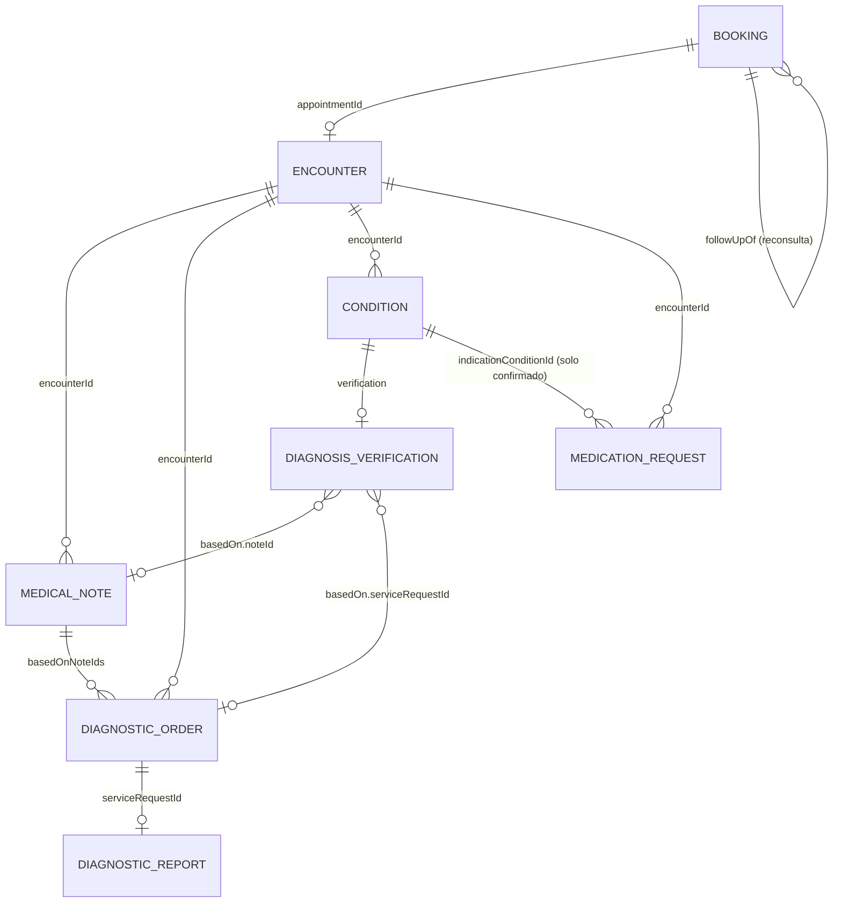
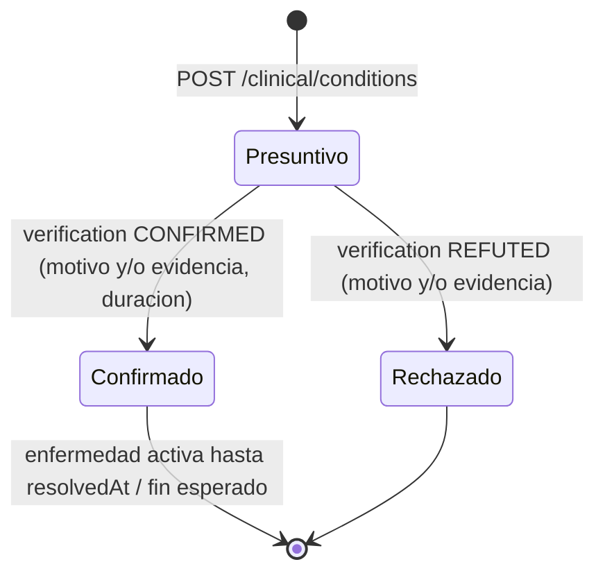

# PLAN MAESTRO — El encuentro clínico doctor–paciente

Notas médicas · órdenes de análisis · diagnóstico presuntivo→confirmado/rechazado · reconsulta · receta · enfermedad activa · historia clínica del paciente · «Mis órdenes» por tipo.

> **Rol de este documento:** es el contrato que comparten los diez carriles del **Paquete 3 — Encuentro clínico** de la noche del 2026-09-25. Se **suma** a los paquetes Farmacia como ecommerce y Carga Masiva de la misma noche (decisión del propietario): no los reemplaza y no toca sus archivos. Cada carril tiene su prompt en la carpeta de su responsable dentro de `repartos/2026-09-25/PromptNoche/` (`Marcelo/`, `Itzan/`, `Justin/`, `Pablo/`, carpetas `Noche-EncuentroClinico.C*`); ese prompt manda cuando difiere de este plan.
> **Reparto (Ender sin carril hoy, por pedido del propietario):** **Marcelo** → C0, C3 · **Itzan** → C1, C2 · **Justin** → C4, C6, C8 · **Pablo** → C9, C5, C7. Total: 113 microtareas (Marcelo 33 · Itzan 22 · Justin 31 · Pablo 27). Este plan fija el modelo, los nombres, los contratos simulados, el reparto, la calidad exigida y las reglas de convivencia.
> **Repo de producto:** `mantra-core-health` (frontend Angular 21, rama `mockup`, simulador en `src/app/core/mock`). **La API no se toca esta noche**: es referencia de nombres; lo que no tiene se simula y se anota como pendiente (P39–P42, §10).
> **Corte:** `origin/mockup` @ `bf2c3545` (merge del PR #660). **Cada carril reconsulta el suyo** y lo anota en su `PLAN.md`.
> **Fuente del pedido:** conversación con el propietario del 2026-09-25, confirmada punto por punto (§0.2) y ampliada esa misma noche con: «Mis órdenes» del paciente por tipo con buscador, filtros y paginación (ADR-0015); calidad visual garantizada con las skills de diseño; Playwright que nunca se queda colgado; todo publicado en `AlovidaPromptManager` `main`.

## 0. El principio y la cadena

### 0.1 El principio

**Cada hecho clínico es un encuentro entre dos entidades.** El encuentro ya existe: `Encounter` (`clinical.encounters`) con `patientProfileId` y `primaryPractitionerId` —las dos entidades— y `appointmentId` que lo ata a la cita. Hoy trabajamos sólo el par **doctor–paciente**; el modelo queda listo para otros pares (paciente–laboratorio ya asoma en `ServiceRequest.performerTenantId`).

Consecuencia para todos los carriles: **todo hecho que nace en la consulta lleva `encounterId`**. En la pantalla de Consulta (`/medical-records/:id/consultation`) el encuentro abierto viene preseleccionado en cada bloque y no se cambia; desde el expediente sigue siendo opcional (compatibilidad).

### 0.2 La cadena, tal como la confirmó el propietario

1. **Nota médica.** Dentro de una cita el doctor escribe lo que observa. Cada nota tiene ID propio. Su contenido es una **tabla de valores clave/valor, dinámica y laxa**, sin campos rígidos. Un solo nombre en todo el sistema: **nota médica**.
2. **Desde las notas, en la misma cita, el doctor puede:** (a) emitir una **orden de análisis** (laboratorio, imagenología u otro); (b) registrar un **diagnóstico presuntivo**; (c) agendar una **reconsulta** con fecha acordada.
3. **Resolución del diagnóstico.** El presuntivo se **confirma o rechaza**, por resultado de un análisis o por decisión del doctor, adjuntando el motivo: texto libre y/o **una nota médica concreta (de qué cita)** o **un análisis concreto (qué orden/informe)**.
4. **Receta.** Nace de un diagnóstico. Siempre ligada a un **diagnóstico confirmado**, o justificada con un **motivo plano** cuando no lo hay.
5. **Enfermedad activa.** Confirmar activa una enfermedad con **duración** (inicio y fin esperado, o crónica). Mientras dura es activa; en la historia clínica aparece bajo diagnósticos históricos cuando termina.
6. **El paciente ve sus órdenes** en «Mis órdenes», **clasificadas por tipo**, con **buscador, filtros y paginación** según la disciplina de tabla de la casa (ADR-0015).

### 0.3 Decisiones tomadas (no se rediscuten esta noche)

| # | Decisión | Por qué |
|---|---|---|
| D-1 | **Presuntivo, confirmado y rechazado son la misma entidad** (`Condition`) con `verificationStatusConceptId` = `DXV-PROVISIONAL` / `DXV-CONFIRMED` / `DXV-REFUTED`. | La API modela el diagnóstico como `clinical.conditions`; el simulador ya tiene los cuatro códigos (`fixtures/conceptos.ts:604`). |
| D-2 | **La confirmación activa la enfermedad**, no la receta. Al confirmar se exige `onsetAt` y (`expectedResolutionAt` o curso crónico) y se pone `clinicalStatus = COND-ACTIVE`. | Confirmado por el propietario. |
| D-3 | **No se receta contra un presuntivo.** El selector lista sólo confirmados + «Otro motivo (escribir)». El simulador responde 422 si `indicationConditionId` apunta a un no confirmado. | Confirmado. Se apoya en `indicationConditionId` (v4.1.6) e `indicationText` (P24). |
| D-4 | **El resultado del análisis, por ahora, es el informe existente** (`DiagnosticReport`) o un adjunto sobre la orden; la confirmación puede citar la orden o el informe. El encuentro paciente–laboratorio como hecho propio queda para otra tanda. | Reduce alcance; el modelo ya soporta `serviceRequestId`/`diagnosticReportId`. |
| D-5 | **La reconsulta es una cita real** creada con `POST /scheduling/appointments/direct`, tipo `APT-RECONSULTA`, con `followUpOf { bookingId, encounterId }`. Se ve en la agenda del doctor y en «Mis citas» del paciente rotulada «Reconsulta». | La API expresa el control como `Appointments.typeConceptId = ACT_FOLLOW_UP`; no hay entidad propia y no la inventamos. |
| D-6 | **Enfermedad activa no es entidad nueva**: es un `Condition` confirmado, activo y sin `resolvedAt`, derivado con un solo ayudante compartido (`diagnosisStateOf`, §3.4). | Alineado con la API. |
| D-7 | **Contrato primero.** C0 fija tipos, conceptos, stubs, casillas y el guardián de Playwright antes de que arranque el resto; después de C0 los archivos compartidos quedan **congelados** (§4.3). | Regla del repo: «primero va el contrato y el mock, y cada prompt se puede mergear solo». |
| D-8 | **Identificadores en inglés, prosa en castellano** (TAREA-29). Los nombres de contrato (`Condition`, `ChartNote`, `MedicationRequest`, `DiagnosticOrder`, `Booking`) no se renombran: transcriben la API. Se homogeneizan rótulos y modelos de vista. | Cero drift de contrato. |
| D-9 | **«Mis órdenes» del paciente pagina en cliente** (`app-pagination`): la lista es local y acotada (`TOPE_DE_ORDENES = 50`), que es el caso 1 de ADR-0015 «Paginación: cliente vs. cursor». | ADR-0015. |
| D-10 | **Un fallo legítimo de Playwright no se relanza**: se diagnostica (`e2e-failure-triage`). Sólo se relanza lo que se colgó sin motivo (servidor caído, sin salida N segundos, `ERR_CONNECTION_REFUSED`, navegador que no arranca). | Pedido del propietario + `NO_TEST_WEAKENING`. |

## 1. Lo que hay hoy (foto del corte)

| Concepto | Existe | Dónde | Hueco |
|---|---|---|---|
| Cita / reserva | Sí | `core/data-access/scheduling/scheduling.types.ts:183` (`Booking`), `features/agenda/**`, `features/account/appointments/**`, mock `handlers/scheduling.handlers.ts`, `fixtures/agenda.ts` | «Completar la cita» (`agenda.ts:2376`) no abre formulario; cinco nombres para la misma cosa (§2). |
| Encuentro | Sí | `clinical.types.ts:131`, `features/clinical-record/consultation/**` (abrir/cerrar), mock `clinical.handlers.ts:274-298`, `fixtures/clinica.ts:116` | No se muestra como eje: ningún bloque lo exige. |
| Nota | Sí, tres cosas distintas | SOAP `ChartNote` (`clinical.types.ts:288`) escrita por `free-note-block` **sólo en `subjectiveText`**; mediciones `Observation` (`clinical.types.ts:115`, `observation-block`, `note-grid`); texto libre `Condition.noteText` | No hay tabla clave/valor; «Nota clínica», «Observación», «Evolución», «Nota de la consulta» conviven. |
| Orden de análisis | Sí | Alta `POST /clinical/service-requests` (`DiagnosticsClient.requestStudy`), lectura `DiagnosticOrder` (`diagnostics.types.ts:33`), bloque `patient-chart/diagnostics-block/` | **No está en la rejilla de la consulta**; no se liga a notas; carpeta `diagnostics-block` choca con `diagnosis-block`. |
| «Mis órdenes» (paciente) | Sí | `features/account/diagnostic-orders/**` (258 líneas ts, agrupa por atención, sin barra ni paginación), `GET /diagnostic-results/me/orders` (`diagnostics.handlers.ts:633`), tipo `PatientOrder` (`diagnostics.types.ts:283`) | Sin clasificación por tipo, sin buscador, sin filtros, sin paginación, sin `app-data-table`. |
| Diagnóstico | Sí | `Condition` (`clinical.types.ts:23`), `diagnosis-block/`, pestaña «Diagnósticos» del expediente, mock `clinical.handlers.ts:391-447`, seed `fixtures/clinica.ts:227` (primero confirmado, resto provisional) | No hay confirmar/rechazar con motivo y evidencia; `change-status` es el eje clínico (activa/resuelta). |
| Reconsulta | **No** | Lo más cercano: `NewDirectAppointment` (`scheduling.types.ts:887`), `appointment-new`; conceptos `ACT-CONTROL`/`APT-CONTROL` | Cero coincidencias de `follow-up`/`reconsulta` en `src/app`. |
| Receta | Sí | `MedicationRequest` (`clinical.types.ts:54`) con `indicationConditionId` e `indicationText`; `medication-block/`; PDF en `shared/utils/clinical-pdf/` | No valida «confirmado o motivo»; el selector lista cualquier diagnóstico. |
| Enfermedad activa / historia | Parcial | Doctor: `patient-chart` (8 pestañas). Paciente: `account/medical-record` (Atenciones, Recetas, Alergias, Resultados) | No hay «en estudio / activas / históricas»; el paciente no ve diagnósticos. |
| Tabla con disciplina (ADR-0015) | Sí, la pieza | `organisms/data-table` (maxHeight, sin scroll lateral), `organisms/filter-bar` (buscador `q` + filtros + acción proyectada), `molecules/pagination` (texto en Anterior/Siguiente, select de página y tamaño), `molecules/row-actions`; consumidor de referencia `account/my-profile/work-history/**` («Dónde atiendo») | Ningún listado clínico la adoptó todavía. |

## 2. Glosario homogéneo (obligatorio para los diez carriles)

Regla: **una palabra en la interfaz, un identificador en código (inglés), un nombre de contrato**. Lo de la columna «Se retira» no puede aparecer en un archivo tocado esta noche; lo que quede en archivos ajenos lo limpia C7.

| Concepto | En la interfaz (única) | Identificador en código | Contrato / API | Se retira |
|---|---|---|---|---|
| Registro que ata doctor y paciente | **Encuentro** | `Encounter`, `encounterId` | `clinical.encounters` | «atención» como sinónimo de encuentro en código nuevo (`AtencionVisible`) |
| La cita agendada | **Cita** («Mis citas»; «Reconsulta» cuando aplica) | `Booking`, `bookingId` | `scheduling.appointment_bookings` | «Turno» en rótulos nuevos (`MIS_TURNOS_ROUTE` se conserva por compatibilidad) |
| Lo que el doctor escribe en la cita | **Nota médica** | `MedicalNote`, `MedicalNoteEntry`, `medical-note-block` | `ChartNote` + `entries` (P39) | «Nota clínica», «Nota de la consulta», «Evolución», «Hoja en blanco» |
| Signo vital o valor medido | **Medición** | `Observation` (contrato), `observation-block` | `clinical.observations` | «Observación» como rótulo |
| Pedido de laboratorio / imagen / otro | **Orden de análisis** (tipo: **Laboratorio · Imagenología · Otro**) | `DiagnosticOrder`, `NewDiagnosticOrder`, `AnalysisCategory`, `analysis-order-block` | `clinical.service_requests` (`SRQ-LAB` / `SRQ-IMAGING` / `SRQ-OTHER`) | «Estudio», «Orden médica», carpeta `diagnostics-block` |
| Resultado de un análisis | **Informe** | `DiagnosticReport` | `clinical.diagnostic_reports` | «Resultado» suelto (sí como pestaña «Mis resultados») |
| Lo que el doctor decide que tiene el paciente | **Diagnóstico** (estado: **Presuntivo · Confirmado · Rechazado**) | `Condition` (contrato), `Diagnosis*` en modelos de vista, `DiagnosisVerification` | `clinical.conditions` + P41 | `DiagnosticoEnFicha`, `DiagnosticoDelPlan`, «Prediagnóstico» |
| Diagnóstico confirmado y vigente | **Enfermedad activa** | `diagnosisStateOf(...) === 'ACTIVE'` | `COND-ACTIVE` sin `resolvedAt` | «Padecimiento», «Condición» en rótulos |
| Diagnóstico terminado | **Diagnóstico histórico** | `'HISTORIC'` | `resolvedAt` o `COND-RESOLVED`/`COND-REMISSION` | — |
| Cita de control pactada | **Reconsulta** | `FollowUp`, `followUpOf`, `follow-up-block` | `APT-RECONSULTA` / `ACT-FOLLOW-UP` (API `ACT_FOLLOW_UP`) + P42 | «Control», «Seguimiento» |
| La prescripción | **Receta** | `MedicationRequest` (contrato), `PrescriptionInChart` en vista | `clinical.medication_requests` | `RecetaEnFicha` |
| Motivo escrito de la receta | **Motivo** | `indicationText` | P24 | «Indicación» como rótulo |
| Por qué se confirma/rechaza | **Motivo de la decisión** | `DiagnosisVerification.reasonText` + `basedOn` | P41 | — |

**Lo que nunca ve el paciente** (`docs/business/glossary.md`): uuids, códigos `SCREAMING_SNAKE`, roles en código, «tenant». Un id de nota se muestra como «Nota #a1b2».

## 3. Modelo objetivo y contratos simulados





### 3.1 Encuentro (sin cambio de forma)

Los bloques de la consulta reciben `[encounterId]="encuentroActual()"` (ya pasa). **Regla nueva:** dentro de la consulta el selector «¿De qué consulta es…?» se oculta y se usa el encuentro abierto; si no hay, el bloque muestra `app-alert` «Abrí el encuentro para registrar» y deshabilita guardar. Desde el expediente el selector sigue.

### 3.2 Nota médica (`MedicalNote`) — C1

Tipos (los agrega **C0** en `clinical.types.ts` y `chart-notes.types.ts`):

```ts
export interface MedicalNoteEntry { readonly label: string; readonly value: string; }
// ChartNote gana:
readonly entries?: readonly MedicalNoteEntry[];
// CreateClinicalNoteInput y AppendClinicalNoteVersionInput ganan:
readonly entries?: readonly MedicalNoteEntry[];
```

Reglas: hasta 40 filas por nota; `label` 1–60 caracteres, `value` 1–500; sin `label` duplicado (comparación sin mayúsculas ni tildes). `subjectiveText` queda como «Texto libre» opcional. Una nota firmada (`signedAt`) no se edita: se agrega versión.

Simulador (`handlers/medical-notes.handlers.ts`: lo crea **C0** moviendo ahí `/charts/notes*` desde `clinical.handlers.ts:595-644`; lo implementa **C1**):

| Método y ruta | Cuerpo | Respuesta | Errores |
|---|---|---|---|
| `POST /charts/notes` | `{ patientProfileId, encounterId?, entries?, subjectiveText?, … }` | `201 { noteId, versionId, versionNumber, lifecycleStatusConceptId, versionStatusConceptId }` | 422 `VALIDATION` (con `details` por fila) si `entries` viola reglas o no hay ni filas ni texto |
| `PUT /charts/notes/:id/versions` | `{ entries?, subjectiveText?, … }` | `201 { … versionNumber+1 }` | 404; 409 `CONFLICT` si está firmada y no viene `amendmentReasonText` |
| `GET /charts/notes?patientProfileId&encounterId&limit` | — | `{ items: ChartNote[], count, limit, nextCursor }` (con `entries`) | 403 si el paciente no es propio ni atendido |
| `POST /charts/notes/:id/versions/:versionId/sign` | — | `200 ChartNote` con `signedAt` | 404 |

Seed (`fixtures/medical-notes.ts`, de C1): 2 notas por paciente con 4–7 filas realistas, ids deterministas `uuid('medical-note-<pid>-<n>')` (C2 y C3 citan `…-0`). La colección vieja `notas` de `fixtures/clinica.ts` no se toca; el `GET` combina ambas.

### 3.3 Orden de análisis (`DiagnosticOrder`) — C2 (y lectura en C9)

Tipos (**C0**, `diagnostics.types.ts`):

```ts
export type AnalysisCategory = 'LAB' | 'IMAGING' | 'OTHER';
// NewDiagnosticOrder gana:
readonly category?: AnalysisCategory;          // el mock lo resuelve a categoryConceptId
readonly basedOnNoteIds?: readonly string[];   // notas que la motivan
// DiagnosticOrder y PatientOrder ganan:
readonly basedOnNoteIds?: readonly string[];   // sólo DiagnosticOrder
readonly category?: AnalysisCategory;          // ambos
```

Simulador: **C0** mueve `POST /clinical/service-requests` (`clinical.handlers.ts:521-583`) a `diagnostics.handlers.ts`; **C2** lo extiende y hace que `GET /diagnostics/patients/:id/orders` **y** `GET /diagnostic-results/me/orders` devuelvan `category` (derivada de `categoryConceptId`: `SRQ-LAB`→`LAB`, `SRQ-IMAGING`→`IMAGING`, resto→`OTHER`). `basedOnNoteIds` valida existencia y paciente (422). Concepto nuevo `SRQ-OTHER` («Otro») en `CATEGORIA_ORDEN` (C0). **C9 no depende de C2**: si `category` no llega, deriva el tipo en cliente desde `categoryConceptId` con el value set (`VS_SERVICE_REQUEST_CATEGORY`).

### 3.4 Diagnóstico (`Condition`) y su verificación — C3

Tipos (**C0**, `clinical.types.ts`):

```ts
export type DiagnosisOutcome = 'CONFIRMED' | 'REFUTED';
export interface DiagnosisEvidence {
  readonly kind: 'NOTE' | 'ANALYSIS';
  readonly noteId?: string;             // kind NOTE
  readonly encounterId?: string;        // de qué cita es la nota (lo resuelve el mock)
  readonly serviceRequestId?: string;   // kind ANALYSIS: la orden
  readonly diagnosticReportId?: string; // kind ANALYSIS: el informe, si existe
}
export interface DiagnosisVerification {
  readonly outcome: DiagnosisOutcome;
  readonly decidedAt: string;
  readonly decidedByProfileId: string;
  readonly reasonText: string | null;
  readonly basedOn: DiagnosisEvidence | null;
}
export interface NewDiagnosisVerification {
  readonly outcome: DiagnosisOutcome;
  readonly reasonText?: string;               // ≤ 500
  readonly basedOn?: DiagnosisEvidence;
  readonly onsetAt?: string;                  // obligatorio al confirmar si no lo tenía
  readonly expectedResolutionAt?: string;     // obligatorio al confirmar salvo curso crónico
  readonly clinicalCourseConceptId?: string;  // crónica ⇒ sin fin esperado
}
// Condition gana:
readonly verification?: DiagnosisVerification | null;
```

Ayudante compartido (**C0**, `src/app/shared/clinical/diagnosis-state.ts` + spec):

```ts
export type DiagnosisState = 'IN_STUDY' | 'ACTIVE' | 'HISTORIC' | 'REFUTED';
export const DIAGNOSIS_STATE_LABELS: Record<DiagnosisState, string>; // En estudio · Enfermedad activa · Diagnóstico histórico · Rechazado
export function diagnosisStateOf(c: Pick<Condition,'verificationStatusConceptId'|'clinicalStatusConceptId'|'resolvedAt'|'expectedResolutionAt'>, codes: { confirmed: string; refuted: string; active: string }, now = new Date()): DiagnosisState
// REFUTED si verificación = refuted · IN_STUDY si no confirmado · ACTIVE si confirmado, clínico activo, sin resolvedAt y (sin fin esperado o fin ≥ hoy) · HISTORIC en el resto.
```

Simulador (`handlers/diagnosis-verification.handlers.ts`: stub de **C0**, implementación de **C3**):

| Método y ruta | Cuerpo | Respuesta | Errores |
|---|---|---|---|
| `POST /clinical/conditions/:id/verification` | `NewDiagnosisVerification` | `200 Condition` con `verification`, `verificationStatusConceptId` = `DXV-CONFIRMED`/`DXV-REFUTED`; al confirmar `clinicalStatusConceptId = COND-ACTIVE`, `onsetAt`, `expectedResolutionAt`; al rechazar `resolvedAt = ahora` | 404; 409 si ya no está en `DXV-PROVISIONAL`; 422 si falta `reasonText` **y** `basedOn`; 422 si la evidencia no existe o no es del paciente; 422 al confirmar sin fin ni curso crónico |

Transiciones: sólo `PROVISIONAL → CONFIRMED | REFUTED`; ambos terminales. `DXV-DIFFERENTIAL` no se usa.

### 3.5 Reconsulta (`FollowUp`) — C4

Tipos (**C0**, `scheduling.types.ts`):

```ts
export interface FollowUpOrigin { readonly bookingId: string; readonly encounterId: string | null; }
// NewDirectAppointment gana:
readonly followUpOf?: FollowUpOrigin;   // el mock pone typeConceptId = APT-RECONSULTA
// Booking gana:
readonly followUpOf?: FollowUpOrigin | null;
```

Conceptos (**C0**): `ACTIVIDAD += ['ACT-FOLLOW-UP','Reconsulta']`, `TIPO_CITA += ['APT-RECONSULTA','Reconsulta']`.

Simulador (`scheduling.handlers.ts:357`, dueño **C4**): con `followUpOf` valida que la cita origen exista (404), sea del mismo paciente y `startAt` futuro (422), que el `resourceId` sea del doctor de la sesión (403); crea la reserva `BK-CONFIRMED` con `typeConceptId = TIPO_CITA['APT-RECONSULTA']`, `reasonText` = «Reconsulta: <motivo origen>» si no se mandó otro, y `followUpOf`. `GET /scheduling/bookings` y `/:id` devuelven `followUpOf`. 409 si ya existe una reconsulta futura de la misma cita origen (una por cita; reprogramar es la vía).

### 3.6 Receta (`MedicationRequest`) — C5

Sin tipos nuevos. Reglas en `clinical.handlers.ts:299` (dueño **C5**): 422 si no viene ni `indicationConditionId` ni `indicationText`; 422 si `indicationConditionId` apunta a un no confirmado («La receta sólo se liga a un diagnóstico confirmado»); si vienen los dos, gana la condición (criterio P24). `POST /clinical/medication-requests/:id/edit` (existe en la API, no en el mock) acepta ligar después, sólo en borrador (409 si emitida). La lectura trae ambos campos; el PDF muestra «Diagnóstico: <nombre>» o «Motivo: <texto>».

### 3.7 Historia clínica del paciente — C6

Sólo lectura. Tres grupos de diagnósticos con `diagnosisStateOf`: **En estudio**, **Enfermedades activas** («hasta <fecha>» o «crónica»), **Diagnósticos históricos** (resueltos y rechazados, con la razón). Cada atención muestra su línea de hechos (nota → orden → diagnóstico → reconsulta → receta) con el organismo compartido `app-encounter-timeline`.

### 3.8 «Mis órdenes» del paciente — C9

Sin tipos ni mock nuevos (usa `GET /diagnostic-results/me/orders` tal cual, con `category` si C2 lo dejó, o derivándola por `categoryConceptId`). Composición obligatoria (Regla 8 + ADR-0012/0013/0015):

- `app-page-header` + **una** `app-card` centrada a lo ancho con `app-tabs`: **Todas (n) · Laboratorio (n) · Imagenología (n) · Otros (n)**.
- Dentro de cada pestaña: `app-filter-bar` (buscador `q` multicampo con debounce 300 ms, normalizado: estudio, estado, consulta, preparación; filtros `app-select`: **Estado** (los presentes), **Resultado** (Con resultado / Sin resultado), **Período** (30 / 90 / 365 días / Todo); sin hueco de acción: es sólo lectura) → `app-data-table` con `maxHeight` (Regla 6, sin scroll lateral; en móvil pliega por prioridad) → `app-pagination` abajo a la derecha (Regla 7; tamaños 10 / 25 / 50; en cliente, D-9).
- Columnas: **Pedida** (fecha) · **Estudio** · **Tipo** (`app-badge`) · **Estado** (`app-status-seal`) · **Resultado** («Disponible» con enlace a «Mis resultados» / «Pendiente») · **Consulta** («Consulta del dd/mm» o «Sin consulta») · **Acciones** (`app-row-actions` con texto: «Ver resultado», «Ver preparación» → `app-content-dialog`, «Ver liquidación» si hay `insuranceSettlement`).
- Estado en la URL (`q`, `tipo`, `estado`, `resultado`, `periodo`, `pagina`, con `replaceUrl: true`) para que F5 y el botón Atrás conserven la vista.
- Estados M34 con `app-view-state-host`: S2 esqueleto de filas; S3 vacío por pestaña con próxima acción («Cuando tu médico te pida un análisis va a aparecer acá»); vacío por filtro («Ninguna orden coincide» + «Limpiar filtros»); S7 si `truncated`; S9 con ID de petición.
- Lo que hoy existe (preparación, liquidación del seguro, enlace al resultado) **se conserva** dentro de la nueva estructura.

### 3.9 `data-testid` acordados (los usan los Playwright de cada carril y el de C8)

| Pantalla | testid |
|---|---|
| Consulta, casillas | `consulta-casilla-notas`, `consulta-casilla-ordenes`, `consulta-casilla-diagnosticos`, `consulta-casilla-reconsulta`, `consulta-casilla-medicacion` (C0) |
| Nota médica | `nota-medica-form`, `nota-medica-fila`, `nota-medica-agregar-fila`, `nota-medica-quitar-fila`, `nota-medica-guardar`, `nota-medica-lista`, `nota-medica-item`, `nota-medica-firmar` |
| Orden de análisis | `orden-form`, `orden-tipo-LAB` / `orden-tipo-IMAGING` / `orden-tipo-OTHER`, `orden-basada-en-nota`, `orden-guardar`, `orden-item` |
| Diagnóstico | `diagnostico-form`, `diagnostico-guardar`, `diagnostico-item`, `diagnostico-estado`, `diagnostico-acciones`, `diagnostico-confirmar`, `diagnostico-rechazar`, `verificacion-dialogo`, `verificacion-motivo`, `verificacion-evidencia-nota`, `verificacion-evidencia-orden`, `verificacion-inicio`, `verificacion-fin-esperado`, `verificacion-cronica`, `verificacion-guardar` |
| Reconsulta | `reconsulta-form`, `reconsulta-fecha`, `reconsulta-cupo`, `reconsulta-motivo`, `reconsulta-guardar`, `reconsulta-item`; agenda `cita-reconsulta-sello`; Mis citas `mis-citas-reconsulta-sello` |
| Receta | `receta-form`, `receta-diagnostico`, `receta-motivo`, `receta-guardar`, `receta-item`, `receta-vinculo`, `receta-vincular` |
| Expediente (doctor) | `expediente-enfermedades-activas`, `expediente-diagnosticos-en-estudio`, `expediente-diagnosticos-historicos`, `expediente-nota-entries` |
| Historia (paciente) | `historia-en-estudio`, `historia-activas`, `historia-historicos`, `historia-linea-encuentro`, `historia-reconsulta` |
| Mis órdenes (paciente) | `mis-ordenes-card`, `mis-ordenes-tab-TODAS` / `-LAB` / `-IMAGING` / `-OTHER`, `mis-ordenes-barra`, `mis-ordenes-buscador`, `mis-ordenes-filtro-estado`, `mis-ordenes-filtro-resultado`, `mis-ordenes-filtro-periodo`, `mis-ordenes-tabla`, `mis-ordenes-fila`, `mis-ordenes-paginacion`, `mis-ordenes-vacio`, `mis-ordenes-limpiar-filtros` |

## 4. Los carriles

### 4.1 Tabla de reparto

| Carril | Responsable | Alcance en una línea | Rama | Worktree | Puerto | Horas | Depende de |
|---|---|---|---|---|---|---|---|
| **C0** | **Marcelo** | Contrato primero: tipos, conceptos, stubs, casillas, ayudante compartido, guardián de Playwright, ADR, glosario | `claude/clinica-c0-base` | `wt-clinica-c0` | 4210 | 3 | nada (**va primero y solo**) |
| **C1** | **Itzan** | Nota médica clave/valor: bloque, lista por encuentro, mock, seed | `claude/clinica-c1-notas-medicas` | `wt-clinica-c1` | 4211 | 5–6 | C0 en `origin/mockup` |
| **C2** | **Itzan** | Orden de análisis desde la consulta, tipo Lab/Imagen/Otro, basada en notas, `category` en las dos lecturas | `claude/clinica-c2-ordenes-analisis` | `wt-clinica-c2` | 4212 | 4–5 | C0 |
| **C3** | **Marcelo** | Diagnóstico presuntivo → confirmar/rechazar con motivo y evidencia; enfermedad activa en el expediente del doctor | `claude/clinica-c3-diagnostico` | `wt-clinica-c3` | 4213 | 6–7 | C0 |
| **C4** | **Justin** | Reconsulta: bloque en la consulta, cita real, sellos en agenda y Mis citas | `claude/clinica-c4-reconsulta` | `wt-clinica-c4` | 4214 | 5–6 | C0 |
| **C5** | **Pablo** | Receta ligada a diagnóstico confirmado o motivo plano; vincular después; PDF | `claude/clinica-c5-receta` | `wt-clinica-c5` | 4215 | 3–4 | C0 |
| **C6** | **Justin** | Historia clínica del paciente: en estudio/activas/históricas, línea del encuentro, PDF | `claude/clinica-c6-historia-paciente` | `wt-clinica-c6` | 4216 | 5–6 | C0 |
| **C7** | **Pablo** | Homogeneización de nombres fuera de los archivos de C1–C6/C9; retiro de `free-note-block`; «Notas médicas» | `claude/clinica-c7-nombres` | `wt-clinica-c7` | 4217 | 3–4 | C0 |
| **C9** | **Pablo** | «Mis órdenes» del paciente: pestañas por tipo, buscador, filtros, tabla y paginación ADR-0015 | `claude/clinica-c9-mis-ordenes` | `wt-clinica-c9` | 4219 | 4–5 | C0 |
| **C8** | **Justin** | Integración: mergear C1–C7 y C9, recorrido completo, consolidar pendientes, REPORTE final, daily de equipo | `claude/clinica-c8-integracion` | `wt-clinica-c8` | 4218 | 3–4 | C1–C7, C9 con PR abierto |

**Ritmo por persona** (cada programador en su máquina; en una misma máquina nunca más de dos sesiones a la vez y un solo build/test pesado por vez, porque `vitest` saturado da verde falso): **Marcelo** hace C0 primero y solo (≈3 h; bloquea al resto) y después C3. **Itzan:** C1 y después C2 (o en paralelo si su máquina aguanta). **Justin:** C4, después C6, y C8 a la mañana. **Pablo:** C9 primero (es lo que el propietario pidió ver), después C5 y C7. Mientras C0 no está en `origin/mockup`, cada uno adelanta lo de §4.5. Cómo conviven estos carriles con los de Farmacia y Carga Masiva de la misma persona: §4.6. **Ender no tiene carril esta noche.**

### 4.2 Por qué no se bloquean

- Cada carril tiene **una lista cerrada de archivos reservados** (§7). Ningún archivo aparece en dos listas.
- Lo que dos carriles necesitarían tocar **lo toca C0 antes** (tipos, conceptos, casillas, registro y mudanzas de handlers, rename de `diagnostics-block`, `diagnosisStateOf`, `pw-guard`).
- Los cruces entre carriles son **sólo ids en texto** (`basedOnNoteIds`, `basedOn.noteId`, `indicationConditionId`, `followUpOf.encounterId`). Nadie importa un componente de otro carril. C9 lee `category` si está y si no la deriva.
- `fixtures/clinica.ts` es el único archivo con **dos dueños por región**: C3 sólo `CondicionSimulada`/`condiciones` (líneas 33-52 y 227-245); C2 sólo `OrdenSimulada`/`ordenes` (462-504). Regiones no adyacentes: git las mergea solo.
- Cada carril escribe su pendiente de backend en **su** `REPORTE.md`; C8 consolida en `PENDIENTES-BACKEND.md`. Nadie edita ese archivo esta noche.
- Cada carril usa **su puerto** y **su worktree** (ruta sin punto: `wt-clinica-cN`).

### 4.3 Archivos congelados después de C0 (nadie los edita en C1–C7, C9)

`core/data-access/clinical/clinical.types.ts` · `core/data-access/chart-notes/chart-notes.types.ts` · `core/data-access/diagnostics/diagnostics.types.ts` · `core/data-access/scheduling/scheduling.types.ts` · `core/mock/fixtures/conceptos.ts` · `core/mock/handlers/index.ts` · `features/clinical-record/consultation/**` · `shared/clinical/diagnosis-state.ts` · `scripts/pw-guard.mjs` · `app.routes.ts` · `core/navigation/**` (salvo la línea del rótulo «Evoluciones», de C7) · `docs/adr/**` · `PENDIENTES-BACKEND.md`.

Si un carril necesita un campo más en un tipo congelado: **lo declara en un archivo propio** (`<carril>.types.ts` dentro de su feature) con `// TODO C8: subir a <tipo congelado>` y lo anota en su `REPORTE.md`. C8 lo sube.

### 4.4 Cómo arranca cada carril (idéntico para todos)

`<raíz de tus repos>` es la carpeta donde conviven `mantra-core-health` y `AlovidaPromptManager` (en la máquina del propietario, `<raíz de tus repos>/`).

```bash
cd <raíz de tus repos>
git -C mantra-core-health fetch origin mockup
git -C mantra-core-health log --oneline -8 origin/mockup   # C1..C9: el commit «feat(clinica): contrato primero (C0)» tiene que estar
git -C mantra-core-health worktree add ../wt-clinica-cN -b claude/clinica-cN-<slug> origin/mockup
cd wt-clinica-cN && corepack yarn install --immutable
# Estándar de la casa (§5.1) → después PLAN.md propio → después código
corepack yarn start --port 421N        # en background (Bash run_in_background: true)
```

Baseline obligatorio antes de tocar (`evidencia/antes/`): `yarn lint; echo exit=$?`, `yarn typecheck; echo exit=$?`, `yarn test --watch=false --include=<sus carpetas>; echo exit=$?`. Cada rojo previo se clasifica (`PRODUCT_BUG` / `TEST_BUG` / `ENVIRONMENT`) y, si no toca archivos reservados, **se anota, no se arregla**.

### 4.5 Mientras C0 corre (≈3 h): qué se adelanta sin pisar a C0

| Carril | Podés arrancar ya, desde `origin/mockup` sin C0 | Esperá a C0 para |
|---|---|---|
| C1 | `fixtures/medical-notes.ts`, `filasDeNotaMedica` en el faker, diseño del bloque con datos de muestra | `medical-notes.handlers.ts` (lo crea C0), `chart-notes.client.ts` (necesita `entries` en los tipos), el bloque real |
| C2 | seed de órdenes en `fixtures/clinica.ts` (462-504), catálogo de estudios por tipo | `diagnostics.handlers.ts` (C0 pega ahí `POST /clinical/service-requests`), cliente, bloque |
| C3 | seed de condiciones (33-52, 227-245), diseño del modal | handler de verificación (C0 crea el stub), cliente, bloque, expediente |
| C4 | seed de agenda, lógica y spec del handler de cita directa (el mock no depende de los tipos) | cliente, bloque, sellos (necesitan `Booking.followUpOf`) |
| C5 | **todo** (no depende de C0) | — |
| C6 | organismo `encounter-timeline` con datos de muestra | pestaña «Diagnósticos» (`diagnosisStateOf` es de C0) |
| C7 | inventario `grep`; renombres en `care-plan-block`, `procedures-block`, `toast-samples`, `aviso-ficha-medica.spec.ts`; «Notas médicas» | borrar `free-note-block` (C0 quita su import de la consulta), `observation-block`/`measurement-grid` |
| C9 | **todo** (deriva el tipo por `categoryConceptId`) | — |

Cuando C0 llega: `git fetch origin mockup && git rebase origin/mockup` en tu rama (archivos disjuntos: sin conflictos) y seguís.

### 4.6 Convivencia con los otros dos paquetes de la misma noche

Farmacia como ecommerce y Carga Masiva corren esta misma noche, con las mismas cuatro personas y sobre el mismo repo. Se cruzaron las listas de archivos reservados de sus ocho prompts contra las de estos diez carriles: **no hay ningún archivo compartido entre personas distintas**. Los dos cruces que existen son de la misma persona y se resuelven en secuencia, nunca con dos worktrees abiertos sobre el mismo archivo:

| Persona | Este paquete | Otro paquete | Regla |
|---|---|---|---|
| Pablo | C7: una línea de `core/navigation/navigation.map.ts` («Evoluciones» → «Notas médicas») | Farmacia reserva `core/navigation/**` entero («Lugares cercanos desaparece») | El cambio de C7 se hace después o dentro de la rama de Farmacia, y se anota en el daily en qué rama quedó |
| Justin | C6: `account/medical-record/**` menos `where-to-buy/**` | Farmacia reserva `account/medical-record/where-to-buy/**` | Cada rama toca sólo su parte de la carpeta |

Los dos paquetes anteriores tocan `app.routes.ts` (entradas concretas); este paquete lo deja congelado, así que no compite. Si durante la noche aparece otro cruce, se anota en el daily de equipo **antes** de tocar el archivo.

## 5. Calidad garantizada: lo que cada carril carga y demuestra

### 5.1 Instalar el estándar (primero, siempre)

```bash
git -C <raíz de tus repos>/AlovidaPromptManager pull --ff-only origin main
# dentro del worktree del carril: fusionar, NO pisar (el front trae 4 skills y 3 agentes propios)
cp -rn ../AlovidaPromptManager/.claude/skills/* .claude/skills/
cp -rn ../AlovidaPromptManager/.claude/rules  .claude/ 2>/dev/null || cp -rn ../AlovidaPromptManager/.claude/rules/* .claude/rules/
cp -rn ../AlovidaPromptManager/.claude/hooks  .claude/ 2>/dev/null || true
ls .claude/skills | wc -l                        # pegá el número en tu daily
ls .claude/rules/[0-9]*.md | wc -l
python .claude/hooks/plan_gate.py --self-test    # PASS/FAIL, pegado
```

Los `.claude/` instalados **no se commitean** en el repo de producto (ver `.gitignore`; si no está ignorado, dejarlos fuera del `git add`).

### 5.2 Skills obligatorias por momento (cárgalas con la herramienta Skill, no las leas de pasada)

| Momento | Skills (Prompt Manager) | Skills / agentes del repo de producto |
|---|---|---|
| Al recibir el carril | `skills-router` → `outcome-first` → `context-thrift` → `factual-discovery` → `anti-hallucination-guard` → `milestone-planning` → `scope-discipline` → `lane-authoring` | — |
| Antes de diseñar una pantalla o bloque | `frontend-ui-design` → `visual-hierarchy-composition` → `frontend-design-system` → `frontend-ux-states` → `frontend-responsive-layout` → `frontend-accessibility` → `ux-writing-microcopy` | `project-design-system` (las 8 reglas; Regla 8 «una tarjeta con pestañas, centrada, a lo ancho») |
| Al escribir Angular | `angular-development` · `angular-signals-state` · `angular-forms` + `frontend-forms-ux` · `atomic-design-components` → `smart-dumb-components` → `component-architecture-solid` · `css-architecture` · `native-code-patterns` | `frontend-production-gate` |
| Si hay tabla o listado | `frontend-data-tables` · `search-and-filtering` (+ ADR-0012, ADR-0013, ADR-0015, `CONTRATO-data-table.md`) | — |
| Si toca datos de salud (todos) | `data-privacy-phi` · `clinical-records` · `terminology-value-sets` · `medication-prescription-safety` (C5) · `appointment-scheduling` (C4) · `state-machines-workflows` (C3) | — |
| Tests | `unit-testing` · `angular-testing` · `test-case-design-techniques` · `edge-case-data-catalog` · `e2e-playwright` → si falla `e2e-failure-triage` · `root-cause-debugging` | — |
| Pulido final, antes de cerrar | `frontend-beautiful-ui` → `ui-quality-review` · `visual-proof` · `accessibility-testing` · **`critical-double-review` (después de CADA captura Playwright)** · `evidence-and-verification` · `qa-evidence-reporting` · `work-report-md` · **`pr-mergeable-gate`** · `finish-your-turn` · `rationalization-guard` (cuando te oís decir «debería») | `visual-quality-gate` (viewports, mutación `UI → request → response → persistencia → recarga → UI`) · agentes `visual-reviewer`, `frontend-reviewer`, `regression-auditor` (`.claude/agents/`) — **`NO_SELF_APPROVAL`: los tres se corren como subagentes y sus hallazgos BLOCKER/CRITICAL/HIGH se corrigen antes del PR** |

### 5.3 Gates que cierran un carril (todos, con salida pegada)

1. `yarn lint`, `yarn typecheck`, `yarn build` con exit 0.
2. Tests acotados del carril con «N passed» visible (no un exit 0 mudo) y cobertura que no baja (`core/**`, `shared/**` ≥ 80; `features/**` ≥ 60).
3. `node scripts/check-architecture.mjs`, `check-route-prefixes.mjs`, `check-tokens.mjs`, `check-css-tokens.mjs`, `check-form-pages.mjs` (si tocó formularios), `generate-inventory.mjs --check` (si tocó `shared/`).
4. Playwright del carril verde vía `pw-guard` (§6), con la prueba de mutación y sin errores de consola ni de red nuevos.
5. Capturas **390 · 768 · 1024 · 1440 · 1920**, tema claro y oscuro, de cada superficie tocada, revisadas con `critical-double-review` (segunda pasada adversarial escrita en el daily).
6. Puntuación del playbook §44 (10 dimensiones) **≥ 92**, sin BLOCKER/CRITICAL/HIGH abiertos, firmada por `visual-reviewer` y `frontend-reviewer`; `regression-auditor` sobre los consumidores de lo compartido que se tocó.
7. Regla 8 medida: holgura izquierda ≈ derecha (≤ 2 px) y ancho ≥ 85 % de `.app-main__inner` en las fichas/pantallas nuevas (`playwright/mi-perfil-paciente.mjs` como referencia de medición).
8. Accesibilidad: foco visible, orden de tabulación, `aria` sólo donde el HTML semántico no alcanza, contraste (`check-contrast.mjs`), diálogos con foco atrapado y `Escape`.
9. Microcopy: rótulos del glosario §2, sin uuids ni códigos para el paciente, sin prosa de implementación en pantalla.
10. `pr-mergeable-gate`: PR sin conflictos contra `mockup`, no draft, descripción con «Qué cambia / Tipo / Checklist / Cómo se probó» y los cinco cambios que exigen revisión explícita declarados si aplican.

### 5.4 Reglas de diseño que aplican a todo lo nuevo

- **Regla 8:** ficha/pantalla = **una** `app-card` con `app-tabs`, centrada, a lo ancho; nunca tarjetas apiladas ni bloque pegado a la izquierda.
- **ADR-0015 regla 0:** todo formulario que nace de una acción de tabla va en `app-content-dialog`; la tabla no cambia de alto. Editar abre con campos llenos; guardar se habilita sólo con cambios; guardar confirma; retirar confirma.
- **ADR-0012:** acciones de fila con **texto** (`app-row-actions`), nunca sólo ícono. **ADR-0013:** elegir de una lista cerrada → `app-select` (chips o `app-segmented-control` sólo con justificación escrita).
- **Estados M34** con `app-view-state-host`, siempre; S3 con próxima acción; S9 con ID de petición.
- **Tokens, nunca valores mágicos** (`--sp-*`, `--c-*`, `--r-*`, `--fs-*`); sin Tailwind; sin CSS inline.
- **Primitivas existentes antes de crear** (`docs/components/catalog.md`, `shared/components/{atoms,molecules,organisms}`): `app-fact-list` para pares rótulo/valor, `app-accordion` para plegar, `app-status-seal`/`app-badge` para estados, `app-empty-state`, `app-skeleton`, `app-date-picker`, `app-radio-group`, `app-checkbox-group`, `app-segmented-control`, `app-concept-select`, `app-reference-combobox`, `app-row-actions`, `app-menu`, `app-content-dialog`, `app-filter-bar`, `app-data-table`, `app-pagination`. Crear una pieza nueva sólo si no existe y con spec + entrada en el stock.
- **OnPush, standalone, señales; sin `any`; sin `effect` para derivar** (`computed`); Reactive Forms; componentes < 300 LOC salvo justificación.
- **Movimiento:** transiciones de 150–200 ms con tokens; respetar `prefers-reduced-motion`.

## 6. Playwright que no se queda pillado: `scripts/pw-guard.mjs` (lo crea C0, lo usan todos)

**Regla:** ningún carril corre Playwright «a pelo». Se corre **siempre** a través del guardián, **en background** desde la sesión (la herramienta Bash corta a los 10 min), y se espera la notificación.

```bash
node scripts/pw-guard.mjs --port 4211 --spec playwright/clinica-c1-nota-medica.spec.ts [--spec …] \
  [--attempts 3] [--stall 120] [--deadline 25] [--serve] [--retry-failures]
```

Comportamiento (contrato que C0 implementa y prueba con `--self-test`):

1. **Salud del servidor antes de cada intento:** `GET http://localhost:<port>/` hasta 200 (máx. 180 s, cada 5 s). Si no responde y viene `--serve`, lanza `corepack yarn start --port <port>` desacoplado (log en `artifacts/pw-guard/serve-<port>.log`) y espera la disponibilidad. Si no responde y no viene `--serve`: sale 125 con «servidor caído en :<port>».
2. **Lanza** `corepack yarn playwright test <specs> --workers=1 --reporter=list --timeout=90000` con `E2E_BASE_URL=http://localhost:<port>`; espeja stdout/stderr a consola y a `artifacts/pw-guard/<AAAAMMDD-HHmm>-intento-N.log`.
3. **Detector de cuelgue:** si pasan `--stall` segundos sin una sola línea de salida, **mata el árbol de procesos** (`taskkill /PID <pid> /T /F` en Windows; `process.kill(-pid)` en POSIX), registra `STALL` y **relanza** (cuenta como intento).
4. **Fallos de infraestructura se relanzan** (`ECONNREFUSED`, `net::ERR_CONNECTION_REFUSED`, `browserType.launch` con timeout, `Target closed` antes del primer test, `Error: Timeout` en `page.goto` de la primera navegación, salida distinta de 0 sin ningún `✓`/`✘` impreso).
5. **Un fallo legítimo NO se relanza** (D-10): exit 1 con al menos un `✘` y su aserción impresa → el guardián termina con 1 y escribe `artifacts/pw-guard/last-run.json` con `{ outcome: 'FAILED', attempt, failedTests[] }`. Con `--retry-failures` (sólo para descartar flakiness de datos, y declarado en el daily) reintenta **una** vez.
6. **Tope global** `--deadline` minutos → mata todo y sale 124 con resumen.
7. Códigos de salida: **0** verde · **1** fallo legítimo · **124** tope global · **125** todos los intentos colgados o servidor caído. Siempre imprime al final `RESUMEN: outcome=<…> intentos=<n> duracion=<s>` y deja `last-run.json`.
8. `--self-test`: simula (a) un hijo que no imprime nada (`--stall 3`) y verifica que se mata y relanza; (b) un hijo que sale 0 → `PASS`; (c) un hijo que imprime `✘ 1 fallo` y sale 1 → `FAILED` sin relanzar. Imprime `pw-guard self-test: 3 PASS, 0 FAIL`.
9. Doc: `docs/testing/pw-guard.md` (uso, códigos, qué se considera cuelgue y qué no). `artifacts/pw-guard/**` no se commitea.

Además, en cada spec nuevo: `test.setTimeout(90_000)`; esperas por selector/estado (`expect(locator).toBeVisible()`), **nunca** `waitForLoadState('networkidle')`; login con `playwright/support/sesion.ts`; `test.describe.configure({ mode: 'serial' })` cuando hay dependencia de datos.

Desde la sesión: `Bash` con `run_in_background: true` para `ng serve` y para `pw-guard`; nunca un `sleep` en primer plano; si el guardián devuelve 125 dos veces seguidas, reiniciar `ng serve` (matar el proceso del puerto con `netstat -ano | findstr :421N` + `taskkill /PID … /F`) y anotarlo.

## 7. Microtareas por carril

Formato: `ID · qué · CA (binario) · DoD (comando)`. El estado vive en el `PLAN.md` propio (repo de producto) y el avance en el daily (este repo).

---

### C0 — Contrato primero (una sesión, sola, ~3 h) — **Marcelo**

**Resultado observable:** en `http://localhost:4210/medical-records/<id>/consultation` la rejilla muestra **12 casillas** en este orden: Nota médica · Orden de análisis · Diagnóstico · Reconsulta · Receta · Alergia · Medición · Plan de cuidados · Documento · Formulario clínico · Internación · Pagos; Nota médica, Orden y Reconsulta abren un modal con «En construcción (C1/C2/C4)». `node scripts/pw-guard.mjs --self-test` da 3 PASS. `lint`, `typecheck`, `mock-backend.spec.ts`, `clinical.handlers.spec.ts`, `diagnostics.handlers.spec.ts`, `consultation.spec.ts`, `specialty-form-block.spec.ts` verdes.
**Kill-test:** si `POST /charts/notes` sigue registrado en `clinical.handlers.ts`, o `pw-guard --self-test` no existe, C0 no está hecho.

**Archivos reservados:** los de §4.3 más `core/mock/handlers/clinical.handlers.ts` (sólo **quitar** bloques), `core/mock/handlers/diagnostics.handlers.ts` (sólo **pegar** el bloque movido), `core/mock/handlers/medical-notes.handlers.ts` (nuevo), `core/mock/handlers/diagnosis-verification.handlers.ts` (nuevo), `features/clinical-record/patient-chart/analysis-order-block/**` (rename), `features/clinical-record/patient-chart/specialty-form-block/specialty-form-block.{ts,html,spec.ts}` (sólo import/selector), `features/clinical-record/patient-chart/medical-note-block/**` (stub), `features/clinical-record/patient-chart/follow-up-block/**` (stub), `features/component-stock/component-index.generated.ts` (regenerado), `scripts/pw-guard.mjs`, `docs/testing/pw-guard.md`, `docs/business/glossary.md`, `docs/adr/ADR-0016-encuentro-eje-clinico.md`, `docs/adr/index.md`, `docs/trabajo/2026-09-25-encuentro-clinico/README.md` (puntero a este repo) y `c0/**`, `.gitignore` (sólo `artifacts/pw-guard/`).

| ID | Microtarea | CA (binario) | DoD |
|---|---|---|---|
| C0.H1.M1 | Worktree `wt-clinica-c0`, rama desde `origin/mockup`, estándar instalado (§5.1), corte anotado, baseline a `evidencia/antes/` | `PLAN.md` propio cita SHA; tres `.txt` con exit code | `yarn lint; echo exit=$?` · `yarn typecheck; echo exit=$?` · `yarn test --watch=false --include=src/app/core/mock/** --include=src/app/features/clinical-record/**; echo exit=$?` |
| C0.H1.M2 | `docs/adr/ADR-0016-encuentro-eje-clinico.md` + fila en `docs/adr/index.md`: principio §0.1, cadena §0.2, decisiones D-1..D-10 | El ADR cita rutas reales y no promete nada fuera de este plan | `node scripts/check-doc-links.mjs` |
| C0.H1.M3 | `docs/business/glossary.md`: sección «Clínica — nombres únicos» con la tabla §2; `docs/trabajo/2026-09-25-encuentro-clinico/README.md` que apunta a `AlovidaPromptManager/repartos/2026-09-25/PromptNoche/` | Cada fila con sus tres columnas y «Se retira» | `node scripts/check-doc-links.mjs` |
| C0.H2.M1 | `conceptos.ts`: `ACTIVIDAD += ['ACT-FOLLOW-UP','Reconsulta']`, `TIPO_CITA += ['APT-RECONSULTA','Reconsulta']`, `CATEGORIA_ORDEN += ['SRQ-OTHER','Otro']` | `terminology.handlers.spec.ts` verde; `$expand` de los tres value sets los devuelve | `yarn test --watch=false --include=src/app/core/mock/handlers/terminology.handlers.spec.ts` |
| C0.H2.M2 | Tipos §3.2 en `clinical.types.ts` (`MedicalNoteEntry`, `ChartNote.entries?`) y `chart-notes.types.ts` | `yarn typecheck` limpio; JSDoc dice qué carril lo llena y qué pendiente lo respalda | `yarn typecheck` |
| C0.H2.M3 | Tipos §3.3 en `diagnostics.types.ts` (`AnalysisCategory`, `basedOnNoteIds`, `category` en `NewDiagnosticOrder`, `DiagnosticOrder` **y `PatientOrder`**) | ídem | `yarn typecheck` |
| C0.H2.M4 | Tipos §3.4 en `clinical.types.ts` (`DiagnosisOutcome`, `DiagnosisEvidence`, `DiagnosisVerification`, `NewDiagnosisVerification`, `Condition.verification?`) | ídem | `yarn typecheck` |
| C0.H2.M5 | Tipos §3.5 en `scheduling.types.ts` (`FollowUpOrigin`, `NewDirectAppointment.followUpOf?`, `Booking.followUpOf?`) | `scheduling.client.spec.ts` verde | `yarn test --watch=false --include=src/app/core/data-access/scheduling/**` |
| C0.H2.M6 | `shared/clinical/diagnosis-state.ts` + spec: `diagnosisStateOf`, `DIAGNOSIS_STATE_LABELS` | 8 casos: confirmado activo sin fin · con fin futuro · con fin pasado · con `resolvedAt` · clínico resuelto · provisional · rechazado · crónico sin fin | `yarn test --watch=false --include=src/app/shared/clinical/**` |
| C0.H3.M1 | Mudanza 1: `/charts/notes*` (`clinical.handlers.ts:595-644`) → `handlers/medical-notes.handlers.ts` (`registrarNotasMedicas`), registrado **después** de `registrarClinica` en `index.ts` | `router.rutas()` conserva las 3 rutas; `clinical.handlers.spec.ts` y `mock-backend.spec.ts` verdes | `yarn test --watch=false --include=src/app/core/mock/**` |
| C0.H3.M2 | Mudanza 2: `POST /clinical/service-requests` (`clinical.handlers.ts:521-583`) → `diagnostics.handlers.ts` | ídem; `diagnostics.handlers.spec.ts` verde | ídem |
| C0.H3.M3 | Stub `handlers/diagnosis-verification.handlers.ts` (`registrarVerificacionDiagnostica`): `POST /clinical/conditions/:id/verification` → `notFound('Pendiente: carril C3')`; registrado después de `registrarClinica` | `mock-backend.spec.ts` verde (404 no es 500) | ídem |
| C0.H4.M1 | `git mv diagnostics-block analysis-order-block`; clase `AnalysisOrderBlock`, selector `app-analysis-order-block`, archivos `analysis-order-block.{ts,html,css,spec.ts}`; actualizar `specialty-form-block.{ts,html,spec.ts}` y el comentario de `misc.handlers.ts:96`; `yarn stock:generate` | `grep -rn "diagnostics-block\|DiagnosticsBlock" src/app` = 0 | `yarn typecheck` · `yarn test --watch=false --include=src/app/features/clinical-record/patient-chart/analysis-order-block/** --include=src/app/features/clinical-record/patient-chart/specialty-form-block/**` |
| C0.H4.M2 | Stub `medical-note-block/` (`app-medical-note-block`; inputs `patientProfileId`, `encounterId`, `citas`; output `guardada`; `app-alert` «En construcción (C1)») + spec mínimo | Aparece en `/design-system/stock` | `yarn stock:generate` · spec |
| C0.H4.M3 | Stub `follow-up-block/` (`app-follow-up-block`; inputs `patientProfileId`, `encounterId`, `bookingId: string \| null`; output `cambio`; «En construcción (C4)») + spec mínimo | ídem | ídem |
| C0.H4.M4 | `consultation.ts`: `CasillaDeConsulta` += `'ordenes' \| 'reconsulta'`; `CASILLAS`: `notas` → «Nota médica» / «Lo que observaste, en filas: campo y valor.» / modal «Escribir una nota médica»; `observaciones` → «Medición» / «Un signo vital o un valor medido.» / «Registrar una medición»; `ordenes` → «Orden de análisis» / «Laboratorio, imagenología u otro, a partir de tus notas.» / «Pedir un análisis» / testId `consulta-casilla-ordenes`; `reconsulta` → «Reconsulta» / «La próxima cita, con fecha acordada.» / «Agendar la reconsulta» / testId `consulta-casilla-reconsulta`; `ORDEN_DE_CASILLAS` = notas, ordenes, diagnosticos, reconsulta, medicacion, alergias, observaciones, planes, documentos, formulario, internacion, pagos; `cantidad` de `ordenes` = órdenes del paciente si ya se leen, si no `null` | 12 casillas en ese orden | `yarn test --watch=false --include=src/app/features/clinical-record/consultation/**` (spec: 10→12 y títulos) |
| C0.H4.M5 | `consultation.html`: `@case ('notas')` monta `app-medical-note-block`; `@case ('ordenes')` monta `app-analysis-order-block` (`[patientProfileId]`, `[encounterId]`, `(cambio)="altaRegistrada()"`); `@case ('reconsulta')` monta `app-follow-up-block` con `[bookingId]="citaDeLaUrl()"` (el `?cita=` de `CITA_QUERY_PARAM`); quitar el import de `free-note-block` | Las tres casillas abren `consulta-modal` | ídem + capturas de la rejilla y los tres modales |
| C0.H5.M1 | `scripts/pw-guard.mjs` según §6 (ESM, sin dependencias nuevas, Windows y POSIX) + `--self-test` + `docs/testing/pw-guard.md` + `.gitignore` de `artifacts/pw-guard/` | `node scripts/pw-guard.mjs --self-test` → `3 PASS, 0 FAIL`; una corrida real contra 4210 con `playwright/consulta-rejilla.spec.ts` sale 0 o 1 con `RESUMEN:` | los dos comandos |
| C0.H6.M1 | Gates §5.3 (1, 2, 3) + skills de cierre + `REPORTE.md` | Todo con exit 0, salida en `evidencia/despues/` | comandos con `; echo exit=$?` |
| C0.H6.M2 | Commits Conventional por microtarea (`feat(clinica): contrato primero (C0) — …`, `refactor(mock): …`, `chore(scripts): pw-guard`), `git pull --rebase origin mockup`, `git push origin HEAD:mockup` (regla de cierre del propietario) **y** `git push -u origin claude/clinica-c0-base` + PR `--base mockup` | `git rev-parse origin/mockup` contiene los commits; PR abierto | `git fetch origin mockup && git log --oneline -8 origin/mockup` |
| C0.H6.M3 | Sección «Carril C — Encuentro clínico · C0» de tu daily `Marcelo/Marcelo-Daily-Noche-2026-09-25.md` (sin tocar tus secciones de Farmacia y Carga Masiva) en este repo (formato del daily de Pablo), commit y `git push origin main`; aviso a Itzan, Justin y Pablo (`SendMessage` si comparten máquina; si no, por el canal del equipo): «C0 en origin/mockup @ <sha>; arranquen C1, C2, C4, C5, C9» | El daily tiene el SHA, los números de la instalación del estándar y la lista de archivos tocados | `git -C ../AlovidaPromptManager log --oneline -1 origin/main` |

---

### C1 — Nota médica (5–6 h) — **Itzan**

**Resultado observable:** en la consulta, «Nota médica» abre un formulario de **filas campo/valor** (una fila vacía inicial, «Agregar fila», «Quitar», texto libre opcional), guarda con `POST /charts/notes` y debajo lista las notas **de este encuentro** y, plegadas, las anteriores del paciente, cada una con ID corto, fecha, autor, sello Borrador/Firmada y su tabla. F5 conserva la nota.
**Kill-test:** guardar una nota con dos filas, F5, y si no aparecen las dos filas con sus rótulos, C1 no está hecho.
**Diseño:** formulario dentro del `app-content-dialog` de la consulta: cada fila es una cuadrícula de dos `app-form-field` (rótulo con `app-input`, valor con `app-textarea` de una línea que crece) y un `app-button variant="ghost"` «Quitar» con texto (ADR-0012); «Agregar fila» secundario; `Enter` en el valor agrega fila; contador «n de 40». La lista usa `app-card` por nota con cabecera (fecha, autor, `app-badge` de estado) y `app-fact-list` para los pares; «Anteriores» en `app-accordion`. Estados con `app-view-state-host`.

**Archivos reservados:** `features/clinical-record/patient-chart/medical-note-block/**` · `core/data-access/chart-notes/chart-notes.client.ts` (+ `.spec.ts` nuevo) · `core/mock/handlers/medical-notes.handlers.ts` (+ `.spec.ts` nuevo) · `core/mock/fixtures/medical-notes.ts` (nuevo) · `core/mock/faker/clinico.ts` (sólo agregar `filasDeNotaMedica(f)`) y su export en `faker/index.ts` · `playwright/clinica-c1-nota-medica.spec.ts` · `docs/trabajo/2026-09-25-encuentro-clinico/c1/**`.
**OUT:** `free-note-block/**` (C7) · `note-grid` · `observation-block` · `progress-notes` · `patient-chart` · tipos congelados.

| ID | Microtarea | CA | DoD |
|---|---|---|---|
| C1.H1.M1 | Arranque §4.4, estándar §5.1, baseline, `PLAN.md` con corte | SHA anotado; baseline en `evidencia/antes/` | comandos de baseline |
| C1.H2.M1 | `fixtures/medical-notes.ts`: `MedicalNoteSimulada` (= `NotaSimulada` + `entries`), colección `notasMedicas` persistida en `mock.clinica.notasMedicas`, 2 notas por paciente con 4–7 filas de `fk.clinico.filasDeNotaMedica`, ids `uuid('medical-note-<pid>-<n>')` | Determinista: dos `crearRouterSimulado()` dan los mismos ids | spec del handler |
| C1.H2.M2 | `medical-notes.handlers.ts`: `POST /charts/notes` con reglas §3.2 (422 `VALIDATION` + `details` por fila); `PUT …/versions`; `GET /charts/notes` (filtros `patientProfileId`, `encounterId`, `limit`; combina `notasMedicas` + `notas` viejas); `POST …/versions/:versionId/sign`; y **registrar en este archivo** `GET /charts/patients/:id/chart` que llama al handler previo y agrega las notas con `entries` (gana el registrado después; `// TODO C8: función exportada en clinical.handlers.ts`) | spec: alta, validación por fila, listado por encuentro, firma, chart con `entries` | `yarn test --watch=false --include=src/app/core/mock/handlers/medical-notes.handlers.spec.ts --include=src/app/core/mock/mock-backend.spec.ts` |
| C1.H2.M3 | `chart-notes.client.ts`: `listNotes(query)`, `signVersion(noteId, versionId)`; `createNote`/`appendVersion` mandan `entries` **sólo si hay filas** | `chart-notes.client.spec.ts` nuevo con `HttpTestingController`, cuerpos exactos | `yarn test --watch=false --include=src/app/core/data-access/chart-notes/**` |
| C1.H3.M1 | `medical-note-block`: Reactive Form con `FormArray` de filas, validación en vivo (duplicado, largo, 40), texto libre opcional | Con 0 filas y sin texto, Guardar deshabilitado; con una fila válida, habilitado | spec |
| C1.H3.M2 | Guardar: `createNote({ patientProfileId, encounterId, entries, subjectiveText })`; encuentro fijo en consulta (§3.1); tras guardar limpia, emite `guardada`, relee | Mutación demostrada `UI → request → response → recarga → UI` | Playwright |
| C1.H3.M3 | Lista: «De esta consulta» arriba, «Anteriores» plegadas (por paciente, desc); ítem con ID corto, fecha, autor, `app-fact-list`, sello, «Firmar» (`signVersion`) | Firmada no muestra «Firmar» ni deja editar | spec |
| C1.H3.M4 | Estados M34 con `app-view-state-host` (S2, S3 «Escribí la primera nota», S9 con ID) | Los tres se ven forzando `mock:fallos` | capturas |
| C1.H4.M1 | Playwright `clinica-c1-nota-medica.spec.ts` (vía `pw-guard --port 4211`): médica → Mis citas → Iniciar consulta → Nota médica → 3 filas → guardar → ítem con 3 filas → F5 → sigue → firmar → sello Firmada | verde | `node scripts/pw-guard.mjs --port 4211 --spec playwright/clinica-c1-nota-medica.spec.ts` |
| C1.H4.M2 | Capturas 390/768/1024/1440/1920, claro y oscuro; a 390 la fila se apila sin scroll lateral; `critical-double-review` escrita | Sin overflow | capturas |
| C1.H5.M1 | Revisores (`visual-reviewer`, `frontend-reviewer`), gates §5.3, commits por archivo, `pull --rebase` + push a `mockup`, rama, PR, `REPORTE.md` con **P39**, daily en este repo pusheado a `main` | PR abierto; `origin/mockup` contiene los commits; daily en `origin/main` | `git log --oneline -3 origin/mockup` |

---

### C2 — Orden de análisis (4–5 h) — **Itzan**

**Resultado observable:** en la consulta, «Orden de análisis» abre el bloque con **tipo** (Laboratorio · Imagenología · Otro) que filtra el catálogo, la lista de **notas médicas de este encuentro con checkbox** «Basada en esta nota», prioridad y motivo, y guarda con `POST /clinical/service-requests`. Debajo, las órdenes del encuentro con tipo, estado y «según nota #…». Las dos lecturas (doctor y paciente) devuelven `category`. La seed le da al paciente demo material suficiente para que «Mis órdenes» (C9) tenga qué filtrar y paginar.
**Kill-test:** una orden guardada con «Basada en» marcada que vuelve del `GET /diagnostics/patients/:id/orders` sin `basedOnNoteIds`, o un `GET /diagnostic-results/me/orders` sin `category`, y C2 no está hecho.
**Diseño:** tipo con `app-segmented-control` (tres opciones excluyentes que cambian el catálogo: justificación de ADR-0013 escrita en el JSDoc); estudio con `app-concept-select`; notas con `app-checkbox-group`; prioridad `app-select`; lista con `app-data-table` `maxHeight` (ADR-0015 regla 6) y `app-badge` por tipo.

**Archivos reservados:** `features/clinical-record/patient-chart/analysis-order-block/**` · `core/data-access/diagnostics/diagnostics.client.ts` (+ spec) · `core/mock/handlers/diagnostics.handlers.ts` (+ spec) · `core/mock/fixtures/clinica.ts` **sólo 462-504** (`OrdenSimulada`, `ordenes`) · `features/diagnostics/**` (pantalla «Laboratorio e imagen» del doctor) · `playwright/clinica-c2-orden-analisis.spec.ts` · `docs/trabajo/2026-09-25-encuentro-clinico/c2/**`.
**OUT:** `account/diagnostic-orders/**` (C9) · `diagnostic-results/**` · `duplicate-study-warning-dialog` salvo que rompa · tipos congelados.

| ID | Microtarea | CA | DoD |
|---|---|---|---|
| C2.H1.M1 | Arranque, estándar, baseline, `PLAN.md` | — | baseline |
| C2.H2.M1 | `fixtures/clinica.ts` (462-504): `OrdenSimulada` += `basedOnNoteIds`, `category`; seed: cada paciente conserva sus 4 órdenes (2 citan `uuid('medical-note-<pid>-0')`), **y el paciente demo `PACIENTE` (`PACIENTES[0]`) recibe 14 órdenes** repartidas en 3 tipos (`SRQ-LAB`, `SRQ-IMAGING`, `SRQ-OTHER`/`SRQ-PROCEDURE`), 4 estados, fechas de −400 a −3 días, 5 con informe liberado, 3 con `preparationInstructions` | determinismo; `diagnostics.handlers.spec.ts` verde | spec |
| C2.H2.M2 | `diagnostics.handlers.ts`: `POST /clinical/service-requests` acepta `category` (→ `categoryConceptId`) y `basedOnNoteIds` (valida existencia y paciente: 422); `GET /diagnostics/patients/:id/orders` devuelve `category`, `basedOnNoteIds`, `encounterId`, filtro `?encounterId=`; **`GET /diagnostic-results/me/orders` devuelve `category`** | spec: alta con/sin notas, 422 id ajeno, lectura con filtro, lectura del paciente con `category` | `yarn test --watch=false --include=src/app/core/mock/handlers/diagnostics.handlers.spec.ts --include=src/app/core/mock/mock-backend.spec.ts` |
| C2.H2.M3 | `diagnostics.client.ts`: `requestStudy` manda `category` y `basedOnNoteIds` sólo si vienen; `getPatientDiagnostics(id, { encounterId? })` | spec con cuerpos exactos | `yarn test --watch=false --include=src/app/core/data-access/diagnostics/**` |
| C2.H3.M1 | `analysis-order-block`: tipo, catálogo filtrado por prefijo (`STUDY-*` de lab vs imagen: usar `CATEGORIA_ORDEN` del estudio si el catálogo la trae; si no, un mapa local documentado), prioridad, motivo; encuentro fijo en consulta (§3.1) | Cambiar de tipo cambia las opciones | spec |
| C2.H3.M2 | «Basada en»: notas del encuentro por `GET /charts/notes?encounterId=` **con un cliente mínimo propio** (`analysis-order-notes.client.ts`, 1 método, spec, `// TODO C8: ChartNotesClient.listNotes`) | Con 0 notas: «No hay notas en esta consulta; podés pedir el análisis igual» | spec |
| C2.H3.M3 | Lista de órdenes del encuentro bajo el formulario: tipo, estudio, prioridad, estado, «según nota #xxxx» | Tras guardar aparece sin recargar | Playwright |
| C2.H3.M4 | `features/diagnostics`: columna «Tipo» (rótulo de `AnalysisCategory`) y «Según nota» | Se ve con la seed | captura |
| C2.H4.M1 | Playwright `clinica-c2-orden-analisis.spec.ts` (vía `pw-guard --port 4212`): consulta → Orden → Laboratorio → estudio → «Basada en» (si hay nota; si no, lo salta y lo dice) → guardar → ítem → F5 persiste | verde | `node scripts/pw-guard.mjs --port 4212 --spec playwright/clinica-c2-orden-analisis.spec.ts` |
| C2.H4.M2 | Capturas en los cinco viewports, claro/oscuro; `critical-double-review` | — | capturas |
| C2.H5.M1 | Revisores, gates, commits, push a mockup, PR, `REPORTE.md` con **P40**, daily en `main` | — | — |

---

### C3 — Diagnóstico: presuntivo → confirmado / rechazado; enfermedad activa (6–7 h) — **Marcelo**

**Resultado observable:** en la consulta, «Diagnóstico» crea un diagnóstico que nace **Presuntivo**. En la lista del bloque y en la pestaña «Diagnósticos» del expediente, cada presuntivo tiene «Acciones → Confirmar… / Rechazar…» que abre un **modal** con motivo, evidencia (ninguna · una nota médica de una cita · un análisis) y, al confirmar, inicio, fin esperado **o** «Crónica». Al guardar, el estado cambia y el expediente muestra arriba **«Enfermedades activas»** («hasta <fecha>» y días restantes), más «En estudio» e «Históricos».
**Kill-test:** confirmar sin motivo y sin evidencia debe fallar con el 422 visible en el modal; si guarda, C3 no está hecho.
**Diseño:** modal `app-content-dialog` con `app-radio-group` (evidencia), `app-select` de notas agrupadas por fecha de cita y de órdenes/informes, `app-textarea` motivo, `app-date-picker` inicio/fin, `app-checkbox` «Crónica» que deshabilita el fin; sellos `app-status-seal` (Presuntivo = neutro, Confirmado = éxito, Rechazado = peligro); «Enfermedades activas» = `app-card` con `app-fact-list` + `app-progress` del tiempo transcurrido; acciones con `appMenuTrigger` + `app-menu` (ADR-0015).

**Archivos reservados:** `features/clinical-record/patient-chart/diagnosis-block/**` · `features/clinical-record/patient-chart/diagnosis-verify-dialog/**` (nuevo) · `features/clinical-record/patient-chart/patient-chart.{ts,html,css,spec.ts}` · `features/clinical-record/patient-chart/demo-presets.ts` · `core/data-access/clinical/clinical.client.ts` (+ spec: **sólo agregar** `verifyCondition`) · `core/mock/handlers/diagnosis-verification.handlers.ts` (+ spec nuevo) · `core/mock/fixtures/clinica.ts` **sólo 33-52 y 227-245** · `playwright/clinica-c3-diagnostico.spec.ts` · `playwright/diagnostico-que-se-ve.spec.ts` · `playwright/expediente-pestanas-navegador.spec.ts` (ajustar si cambia) · `docs/trabajo/2026-09-25-encuentro-clinico/c3/**`.
**OUT:** `medication-block` (C5) · `care-plan-block` · lado paciente (C6) · `change-status` (se conserva) · tipos congelados.

| ID | Microtarea | CA | DoD |
|---|---|---|---|
| C3.H1.M1 | Arranque, estándar, baseline, `PLAN.md` | — | baseline |
| C3.H2.M1 | `fixtures/clinica.ts` (33-52, 227-245): `CondicionSimulada` += `verification`, `expectedResolutionAt`; seed: el confirmado de cada paciente lleva `verification` (motivo + `basedOn` nota `uuid('medical-note-<pid>-0')`), `expectedResolutionAt` +60 días (crónico si `I10`/`E11.9`); uno de cada tres pacientes con un rechazado | determinismo | spec |
| C3.H2.M2 | `diagnosis-verification.handlers.ts`: `POST /clinical/conditions/:id/verification` con **todas** las reglas de §3.4; exporta `verificarCondicion()` | spec: 9 casos (motivo · nota · orden · sin nada 422 · ya confirmado 409 · rechazar · confirmar sin fin ni crónica 422 · nota ajena 422 · crónica sin fin 200) | `yarn test --watch=false --include=src/app/core/mock/handlers/diagnosis-verification.handlers.spec.ts --include=src/app/core/mock/mock-backend.spec.ts` |
| C3.H2.M3 | `clinical.client.ts`: `verifyCondition(id, body)`; `createCondition` manda `verificationStatusConceptId = DXV-PROVISIONAL` por omisión (leído del catálogo por código) | spec con cuerpo exacto | `yarn test --watch=false --include=src/app/core/data-access/clinical/clinical.client.spec.ts` |
| C3.H3.M1 | `diagnosis-block`: nace presuntivo (sin selector de verificación); rótulo «Nace como presuntivo; lo confirmás o rechazás después»; lista del encuentro con `diagnostico-estado` y menú `diagnostico-acciones` | Confirmado no muestra el menú de verificación | spec |
| C3.H3.M2 | `diagnosis-verify-dialog`: campos y reglas (guardar deshabilitado sin motivo ni evidencia; «Crónica» exime el fin) | — | spec |
| C3.H3.M3 | 409/422 dentro del diálogo con mensaje e ID (S4/S9), sin cerrar | forzado con `mock:fallos` y con el 422 real | capturas |
| C3.H3.M4 | `patient-chart`: tarjeta «Enfermedades activas» sobre las pestañas; pestaña «Diagnósticos» con columna «Estado» (`DIAGNOSIS_STATE_LABELS`) agrupada En estudio / Activas / Históricas; columna «Decisión» (motivo + «por nota del 12/09» / «por informe de hemograma») | Con la seed, la médica ve una activa y una en estudio en el primer paciente | spec + captura |
| C3.H3.M5 | Pestaña «Notas» del expediente: si la nota trae `entries`, `app-fact-list` (`expediente-nota-entries`); si no, texto como hoy | Se ve con seed de C1 o con una creada por `POST` en el spec | spec |
| C3.H4.M1 | Playwright `clinica-c3-diagnostico.spec.ts` (vía `pw-guard --port 4213`): crear → Presuntivo → Confirmar (motivo + fin en 30 días) → Confirmado → expediente lista en Activas → F5; Rechazar con motivo → Históricos | verde | `node scripts/pw-guard.mjs --port 4213 --spec playwright/clinica-c3-diagnostico.spec.ts` |
| C3.H4.M2 | Capturas cinco viewports, claro/oscuro; `critical-double-review` | — | capturas |
| C3.H5.M1 | Revisores, gates, commits, push a mockup, PR, `REPORTE.md` con **P41**, daily en `main` | — | — |

---

### C4 — Reconsulta (5–6 h) — **Justin**

**Resultado observable:** en la consulta, «Reconsulta» abre un bloque con **calendario** (cupos libres del recurso del doctor desde mañana, `GET /scheduling/slots`), motivo precargado «Reconsulta: <motivo de la cita>» editable y «Agendar». Crea una cita real: en «Consultas médicas» la fila lleva el sello **Reconsulta** y «de la cita del <fecha>»; en «Mis citas» del paciente idem. Una segunda reconsulta de la misma cita es rechazada con mensaje.
**Kill-test:** si la reconsulta no aparece en `/my-account/appointments` de `paciente@alovida.mock` con el sello, C4 no está hecho.
**Diseño:** reutilizar `app-date-picker` (organismo) o `app-appointment-calendar` (existente en `account/appointments`), nunca uno nuevo; cupos como `app-radio-group` agrupados «Mañana / Tarde»; éxito con `app-alert variant="success"` y enlace; sello `app-badge` «Reconsulta» en agenda y Mis citas.

**Archivos reservados:** `features/clinical-record/patient-chart/follow-up-block/**` · `core/data-access/scheduling/scheduling.client.ts` (+ spec: **sólo** `createDirectAppointment` con `followUpOf` y lectura de `followUpOf`) · `core/mock/handlers/scheduling.handlers.ts` (+ spec) · `core/mock/fixtures/agenda.ts` (`ReservaSimulada.followUpOf`, seed de 1 reconsulta) · `features/agenda/agenda.{ts,html,css,spec.ts}` (**sólo** sello y `CitaVisible.reconsultaDe`) · `features/agenda/my-agenda/detalle-de-la-cita.ts` (+ spec) · `features/account/appointments/appointments.{ts,html,css,spec.ts}` (**sólo** sello y texto) · `playwright/clinica-c4-reconsulta.spec.ts` · `docs/trabajo/2026-09-25-encuentro-clinico/c4/**`.
**OUT:** `booking-new`, `appointment-new`, `walk-in`, plantillas y cupos · «Completar la cita» · tipos congelados.

| ID | Microtarea | CA | DoD |
|---|---|---|---|
| C4.H1.M1 | Arranque, estándar, baseline, `PLAN.md` | — | baseline |
| C4.H2.M1 | `fixtures/agenda.ts`: `ReservaSimulada.followUpOf`; seed: para `MEDICA`, una reserva futura `APT-RECONSULTA` que cuelga de una completada pasada del mismo paciente | determinismo; `agendas-cobertura.spec.ts` verde | spec |
| C4.H2.M2 | `scheduling.handlers.ts`: `POST /scheduling/appointments/direct` con `followUpOf` (§3.5: 404/422/403/409), `typeConceptId = APT-RECONSULTA`; `GET /scheduling/bookings` y `/:id` devuelven `followUpOf`; la reserva origen expone `followUpBookingId` (campo de lectura en `follow-up.types.ts` propio, `// TODO C8`) | spec: 6 casos | `yarn test --watch=false --include=src/app/core/mock/handlers/scheduling.handlers.spec.ts --include=src/app/core/mock/mock-backend.spec.ts` |
| C4.H2.M3 | `scheduling.client.ts`: `createDirectAppointment` manda `followUpOf` sólo si viene | cuerpo exacto | `yarn test --watch=false --include=src/app/core/data-access/scheduling/**` |
| C4.H3.M1 | `follow-up-block`: lee la cita origen; sin `bookingId` → `app-alert` «La reconsulta se agenda desde una cita: abrí la consulta desde Mis citas»; si ya tiene reconsulta, la muestra con «Reprogramar» hacia la agenda | Los tres estados se ven | spec |
| C4.H3.M2 | Fecha: desde mañana hasta +90 días; al elegir día lista cupos libres (`listSlots({ resourceId, from, to })`) del recurso de la médica; motivo precargado; «Agendar» | Sin cupo elegido no guarda | spec |
| C4.H3.M3 | Éxito: `app-alert` con fecha/hora y «Ver en Consultas médicas»; emite `cambio` | — | Playwright |
| C4.H3.M4 | `agenda.ts/html`: `CitaVisible.reconsultaDe`; sello «Reconsulta» (`cita-reconsulta-sello`) + «de la cita del <fecha>»; `detalle-de-la-cita.ts`: «Qué es» = «Reconsulta» | Se ve con la seed | spec + captura |
| C4.H3.M5 | `account/appointments`: sello (`mis-citas-reconsulta-sello`) y «Tu médico te citó de nuevo por la consulta del <fecha>» | Se ve con `paciente@alovida.mock` | spec + captura |
| C4.H4.M1 | Playwright `clinica-c4-reconsulta.spec.ts` (vía `pw-guard --port 4214`): médica → Iniciar consulta (`?cita=`) → Reconsulta → día/cupo → Agendar → Consultas médicas con sello → paciente → Mis citas con sello; segunda reconsulta → mensaje 409 | verde | `node scripts/pw-guard.mjs --port 4214 --spec playwright/clinica-c4-reconsulta.spec.ts` |
| C4.H4.M2 | Capturas cinco viewports, claro/oscuro; `critical-double-review` | — | capturas |
| C4.H5.M1 | Revisores, gates, commits, push a mockup, PR, `REPORTE.md` con **P42**, daily en `main` | — | — |

---

### C5 — Receta ligada a diagnóstico confirmado o motivo plano (3–4 h) — **Pablo**

**Resultado observable:** en la consulta, «Receta»: «¿Para qué es esta receta?» lista **sólo confirmados** («Confirmado el <fecha>») y «Otro motivo (escribir)» que muestra el textarea; el simulador rechaza con 422 el presuntivo y la receta sin nada, y el modal lo muestra. Lista y PDF dicen «Diagnóstico: X» o «Motivo: …». «Acciones → Vincular a un diagnóstico…» liga después una receta con motivo plano a un confirmado (sólo en borrador; emitida → 409 visible).
**Kill-test:** si el selector muestra un presuntivo, C5 no está hecho.
**Diseño:** `app-select` (ADR-0013) con grupo «Diagnósticos confirmados» y opción «Otro motivo (escribir)»; `app-textarea` con contador ≤ 200; `app-row-actions` con texto; `receta-vinculo` como `app-badge`.

**Archivos reservados:** `features/clinical-record/patient-chart/medication-block/**` · `core/mock/handlers/clinical.handlers.ts` (+ spec; **sólo** el bloque de `medication-requests` 299-349 y sus `attachments`) · `shared/utils/clinical-pdf/**` (**sólo** la sección Diagnóstico/Motivo de la receta) · `playwright/clinica-c5-receta.spec.ts` · `playwright/prescription-official-pdf.spec.ts` (ajustar) · `docs/trabajo/2026-09-25-encuentro-clinico/c5/**`.
**OUT:** `diagnosis-block` (C3) · `where-to-buy` · favoritos · tipos congelados.

| ID | Microtarea | CA | DoD |
|---|---|---|---|
| C5.H1.M1 | Arranque, estándar, baseline, `PLAN.md` | — | baseline |
| C5.H2.M1 | `clinical.handlers.ts` (299-349): reglas §3.6 (`code: 'VALIDATION'`, `details`); `POST …/:id/edit` (nueva en el mock, existe en la API) sólo en borrador (409 emitida) | spec: 6 casos | `yarn test --watch=false --include=src/app/core/mock/handlers/clinical.handlers.spec.ts --include=src/app/core/mock/mock-backend.spec.ts` |
| C5.H3.M1 | `medication-block`: `diagnosticos` filtrados por confirmado (código del catálogo, no uuid pegado); «Otro motivo (escribir)» → `receta-motivo` obligatorio ≤ 200; renombrar `DiagnosticoEnFicha`→`DiagnosisOption`, `RecetaEnFicha`→`PrescriptionInChart` (sólo en esta carpeta) | Guardar deshabilitado sin diagnóstico ni motivo | spec |
| C5.H3.M2 | Errores del servidor en el modal (S4/S9), sin cerrar | forzado | captura |
| C5.H3.M3 | Lista: `receta-vinculo` («Diagnóstico: …» / «Motivo: …»); «Acciones → Vincular a un diagnóstico…» (modal con confirmados; emitida deshabilitado con «Ya emitida») | — | spec |
| C5.H3.M4 | PDF: sección «Diagnóstico» con nombre o «Motivo: …», nunca vacía; `prescription-official-pdf.spec.ts` ajustado | — | comando |
| C5.H4.M1 | Playwright `clinica-c5-receta.spec.ts` (vía `pw-guard --port 4215`): selector sin presuntivos → confirmado → guardar → «Diagnóstico: …» → «Otro motivo» → «Motivo: …» → F5 | verde | `node scripts/pw-guard.mjs --port 4215 --spec playwright/clinica-c5-receta.spec.ts` |
| C5.H4.M2 | Capturas cinco viewports, claro/oscuro; `critical-double-review` | — | capturas |
| C5.H5.M1 | Revisores, gates, commits, push a mockup, PR, `REPORTE.md` (P24 se referencia), daily en `main` | — | — |

---

### C6 — Historia clínica del paciente (5–6 h) — **Justin**

**Resultado observable:** `paciente@alovida.mock` → «Mi historia clínica» tiene una pestaña **«Diagnósticos»** con tres bloques (En estudio · Enfermedades activas «hasta <fecha>»/«crónica» · Históricos con la razón) y, en «Atenciones», cada atención se despliega en una **línea del encuentro** (nota → orden → diagnóstico → reconsulta → receta). «Descargar tu historia» incluye lo mismo.
**Kill-test:** si un diagnóstico rechazado aparece como enfermedad activa, C6 no está hecho.
**Diseño:** Regla 8 (una `app-card` con `app-tabs`); `app-encounter-timeline` = organismo nuevo con riel vertical de fechas, `app-data-type-icon`/`app-service-icon` por hecho, `app-fact-list` por ítem, `app-badge` de estado; `app-accordion` por atención; rótulos para paciente (sin uuids).

**Archivos reservados:** `features/account/medical-record/**` (menos `where-to-buy/**`) · `shared/components/organisms/encounter-timeline/**` (nuevo; recibe datos ya resueltos, **sin** clientes adentro) · `shared/utils/clinical-pdf/from-summary.ts` y `historia*.ts` (**sólo** secciones nuevas de la historia; la receta es de C5: si coincide la función, C6 agrega otra y C8 unifica) · `playwright/clinica-c6-historia-paciente.spec.ts` · `playwright/nova-patient-experience.spec.ts` (ajustar si rompe) · `docs/trabajo/2026-09-25-encuentro-clinico/c6/**`.
**OUT:** todo lo del doctor · clientes (consume `getSummary`, `getChart`, `searchBookings`, `getOwnOrders`; lo que no llegue se omite sin romper) · tipos congelados.

| ID | Microtarea | CA | DoD |
|---|---|---|---|
| C6.H1.M1 | Arranque, estándar, baseline, `PLAN.md` | — | baseline |
| C6.H2.M1 | `encounter-timeline`: inputs tipados, orden cronológico (nota → orden → diagnóstico → reconsulta → receta), rótulos §2, spec, entrada en el stock | Se ve en `/design-system/stock` | `yarn stock:generate` · spec |
| C6.H3.M1 | Pestaña «Diagnósticos» con `diagnosisStateOf`; «hasta» = `expectedResolutionAt`; «crónica» por curso; históricos con `verification.reasonText` o «resuelto el <fecha>» | Con la seed hay uno en cada bloque para el primer paciente | spec |
| C6.H3.M2 | «Atenciones»: `AtencionVisible` → `EncounterInHistory`; al desplegar monta `app-encounter-timeline` con lo filtrado por `encounterId` (`chart.notes`, `getOwnOrders()` al primer despliegue, `summary.conditions`, `summary.medicationRequests`, reconsulta = `searchBookings({ patientProfileId })` con `followUpOf.encounterId === id`) | Desplegar no dispara N peticiones al cargar | spec + pestaña Red |
| C6.H3.M3 | Reglas «Qué nunca ve el paciente»: sin uuids ni códigos; notas como «Nota #a1b2» | HTML sin uuid de 36 caracteres | Playwright asserta |
| C6.H3.M4 | PDF «Descargar tu historia»: secciones nuevas | Se abre y las tiene (compilar y renderizar con pdf.js) | evidencia |
| C6.H4.M1 | Playwright `clinica-c6-historia-paciente.spec.ts` (vía `pw-guard --port 4216`) | verde | `node scripts/pw-guard.mjs --port 4216 --spec playwright/clinica-c6-historia-paciente.spec.ts` |
| C6.H4.M2 | Capturas cinco viewports, claro/oscuro; Regla 8 medida; `critical-double-review` | — | capturas |
| C6.H5.M1 | Revisores, gates, commits, push a mockup, PR, `REPORTE.md`, daily en `main` | — | — |

---

### C7 — Homogeneización de nombres (3–4 h) — **Pablo**

**Resultado observable:** en la interfaz no queda «Nota clínica», «Nota de la consulta», «Evolución/Evoluciones», «Hoja en blanco», «Observación» (medición), «Estudio» (orden), «Prediagnóstico», «Control» (reconsulta) ni «Turno» en rótulos nuevos. El menú «Evoluciones» pasa a **«Notas médicas»** y esa pantalla lista **notas** (una fila por nota) con la tabla de filas al desplegar. `free-note-block` se elimina.
**Kill-test:** `grep -rniE "nota clínica|evoluci[oó]n|hoja en blanco" src/app --include=*.html --include=*.ts` fuera de los archivos de C1–C6/C9 = 0.

**Archivos reservados:** `core/navigation/navigation.map.ts` (**sólo** el rótulo `'Evoluciones'`) · `features/progress-notes/**` · `features/clinical-record/patient-chart/free-note-block/**` (eliminar) · `features/clinical-record/patient-chart/note-grid/**` (→ `measurement-grid`) · `features/clinical-record/patient-chart/observation-block/**` (rótulos «Medición») · `features/clinical-record/patient-chart/care-plan-block/**` (`DiagnosticoDelPlan`→`DiagnosisOption`) · `features/clinical-record/patient-chart/procedures-block/**` (rótulo) · `core/dev/toast-samples.ts` · `core/mock/faker/clinico.ts` (**sólo** `notaDeEvolucion`→`textoDeNotaMedica`; C1 agrega otra función en el mismo archivo: regiones distintas) · `core/mock/aviso-ficha-medica.spec.ts` · `playwright/pdf-premium-evoluciones.spec.ts` (→ `clinica-c7-notas-medicas-pdf.spec.ts`) · `playwright/consulta-rejilla.spec.ts` · `playwright/formularios-cuadricula.spec.ts` · `docs/components/catalog.md` (fila de `free-note-block`) · `docs/trabajo/2026-09-25-encuentro-clinico/c7/**`.
**OUT:** archivos de C1–C6/C9 · `booking-status.ts` duplicados (anotar) · rutas · tipos congelados.

| ID | Microtarea | CA | DoD |
|---|---|---|---|
| C7.H1.M1 | Arranque, estándar, baseline, `PLAN.md`; inventario con `grep` de cada término «Se retira» → `evidencia/inventario.md` (archivo/línea/dueño) | Separa «mío» de «de otro carril» | `grep` guardado |
| C7.H2.M1 | Eliminar `free-note-block/**` (+ catálogo, `yarn stock:generate`) | `grep -rn "free-note-block\|FreeNoteBlock" src` = 0 | `yarn typecheck` |
| C7.H2.M2 | `observation-block` rótulos «Medición»; `note-grid` → `measurement-grid` (carpeta, clase, selector, spec) | `consulta-rejilla` ajustado y verde | `yarn test --watch=false --include=src/app/features/clinical-record/patient-chart/observation-block/** --include=src/app/features/clinical-record/patient-chart/measurement-grid/**` |
| C7.H2.M3 | `progress-notes` → «Notas médicas»: rótulo de menú, título, subtítulo «Lo que escribiste en cada consulta»; **una fila por nota** (`GET /charts/notes?practitionerId=&from=&to=` si C1 lo dejó; si no, bookings + chart como hoy, anotado); `app-filter-bar` (búsqueda por paciente/rótulo, período) + `app-data-table` `maxHeight` + `app-pagination` (ADR-0015); al desplegar, `app-fact-list`; renombres `AtencionRegistrada`→`AttendedEncounter`, `NotaDeLaAtencion`→`MedicalNoteRow` | `progress-notes.spec.ts` verde | `yarn test --watch=false --include=src/app/features/progress-notes/**` |
| C7.H2.M4 | `care-plan-block`, `procedures-block`, `toast-samples`, `faker/clinico.ts`, `aviso-ficha-medica.spec.ts`: renombres §2 | inventario en 0 para archivos propios | `grep` |
| C7.H3.M1 | Playwright `clinica-c7-notas-medicas-pdf.spec.ts` y `consulta-rejilla` (vía `pw-guard --port 4217`) | verdes | `node scripts/pw-guard.mjs --port 4217 --spec playwright/clinica-c7-notas-medicas-pdf.spec.ts --spec playwright/consulta-rejilla.spec.ts` |
| C7.H3.M2 | Capturas de «Notas médicas» en cinco viewports, claro/oscuro; `critical-double-review` | — | capturas |
| C7.H4.M1 | Revisores, gates, commits, push a mockup, PR, `REPORTE.md` con lo que quedó en archivos ajenos (para C8), daily en `main` | — | — |

---

### C9 — «Mis órdenes» del paciente por tipo, con buscador, filtros y paginación (4–5 h) — **Pablo**

**Resultado observable:** `paciente@alovida.mock` → «Mis órdenes» (`/my-account/diagnostic-orders`) es **una tarjeta centrada a lo ancho con cuatro pestañas** (Todas · Laboratorio · Imagenología · Otros, cada una con su conteo); en cada pestaña una barra con buscador y tres filtros, una tabla sin scroll lateral y paginación abajo a la derecha con Anterior/Siguiente con texto, número de página y tamaño. Buscar «hemo» deja sólo hemogramas; filtrar «Con resultado» deja las que enlazan a «Mis resultados»; F5 conserva pestaña, búsqueda, filtros y página. Preparación y liquidación del seguro siguen accesibles desde «Acciones».
**Kill-test:** si la tabla tiene scroll lateral en 390 o 768, o si el paginador no muestra número de página, C9 no está hecho.
**Diseño:** §3.8 al pie de la letra. Referencia de implementación: `account/my-profile/work-history/**` («Dónde atiendo»: `app-filter-bar` + `app-data-table maxHeight` + `app-pagination` en cliente, `normalizarTexto`). Buscador con `searchLabel` «Buscar en tus órdenes» y `searchPlaceholder` «Estudio, estado o consulta». Vacíos con `app-empty-state`. Pestaña activa y filtros en la URL. Fila en móvil: pliega Consulta y Preparación al detalle por prioridad.

**Archivos reservados:** `features/account/diagnostic-orders/**` · `playwright/clinica-c9-mis-ordenes.spec.ts` · `docs/trabajo/2026-09-25-encuentro-clinico/c9/**`.
**OUT:** mock (`diagnostics.handlers.ts` es de C2) · `diagnostic-results/**` · `laboratory-directory` · piezas compartidas (`data-table`, `filter-bar`, `pagination`: si falta algo, se anota, no se toca) · tipos congelados (si `category` no viene, se deriva por `categoryConceptId`).

| ID | Microtarea | CA | DoD |
|---|---|---|---|
| C9.H1.M1 | Arranque, estándar, baseline, `PLAN.md`; capturas «antes» de la pantalla en 390/1440 | — | baseline |
| C9.H2.M1 | Modelo de vista `PatientOrderRow` (renombra `OrdenVisible`): `type: AnalysisCategory` derivado (`category` si viene; si no, por código de `categoryConceptId` contra `VS_SERVICE_REQUEST_CATEGORY` vía `TerminologyClient`), `typeLabel`, `stateLabel`, `hasResult`, `consultationLabel` («Consulta del dd/mm» / «Sin consulta»), `requestedAt`, `preparation`, `settlement` | Sin `any`; sin uuids en la fila | spec |
| C9.H2.M2 | Estado en señales: `tab`, `q`, `estado`, `resultado`, `periodo`, `pagina`, `tamano`; `computed` de filtrado (normalizado, multicampo) y de paginado; sincronización con la URL (`replaceUrl: true`) y lectura inicial desde `ActivatedRoute` | Cambiar cualquier control cambia la URL y volver por URL restaura la vista | spec |
| C9.H3.M1 | Plantilla §3.8: `app-page-header` + `app-card` + `app-tabs` (conteos por tipo) + por pestaña `app-filter-bar` (`filters`: Estado, Resultado, Período; sin acción) + `app-data-table` (`maxHeight`, columnas, `trackBy`, `caption`) + `app-pagination` (10/25/50) | Regla 8 medida (≤ 2 px, ≥ 85 %); sin scroll lateral en ningún viewport | Playwright + capturas |
| C9.H3.M2 | `app-row-actions` con texto: «Ver resultado» (si `hasResult`, a «Mis resultados»), «Ver preparación» (`app-content-dialog`), «Ver liquidación» (si hay `insuranceSettlement`, el `app-patient-insurance-settlement` existente dentro del modal) | Ninguna acción es sólo ícono | spec |
| C9.H3.M3 | Estados M34 con `app-view-state-host`: S2 esqueleto, S3 por pestaña con próxima acción, vacío por filtro con «Limpiar filtros», S7 si `truncated`, S9 con ID | Los cinco se ven (forzando `mock:fallos` y filtros imposibles) | capturas |
| C9.H3.M4 | Accesibilidad: `caption` de la tabla, orden de tabulación barra → tabla → paginación, foco visible, `aria-live` en el conteo de resultados, diálogos con foco atrapado | `accessibility-testing` sin hallazgos serios; `check-contrast.mjs` | evidencia |
| C9.H4.M1 | Playwright `clinica-c9-mis-ordenes.spec.ts` (vía `pw-guard --port 4219`): paciente → Mis órdenes → suma de conteos de pestañas = Todas → «hemo» reduce filas → filtro Resultado → Limpiar → paginar (si hay > 10, cambia de página; si no, asserta «1–n de n») → F5 conserva la vista → «Ver preparación» abre modal | verde | `node scripts/pw-guard.mjs --port 4219 --spec playwright/clinica-c9-mis-ordenes.spec.ts` |
| C9.H4.M2 | Capturas cinco viewports, claro/oscuro; `critical-double-review`; `ui-quality-review` | ≥ 92 | capturas + puntuación |
| C9.H5.M1 | Revisores, gates, commits, push a mockup, PR, `REPORTE.md`, daily en `main` | — | — |

---

### C8 — Integración y recorrido completo (mañana, 3–4 h) — **Justin**

**Resultado observable:** `origin/mockup` contiene C0–C7 y C9 sin conflictos; el recorrido completo pasa en un solo Playwright vía `pw-guard`; `PENDIENTES-BACKEND.md` tiene P39–P42; `REPORTE-FINAL.md` y el daily de equipo existen en este repo.
**Kill-test:** el recorrido completo verde con `--workers=1`; si no, C8 no cierra.

**Archivos reservados:** los `// TODO C8` de C1–C7/C9 (subir tipos a los congelados, unificar clientes duplicados, `GET /charts/patients/:id/chart` limpio, enchufar `encounter-timeline` en `consultation` y `patient-chart`), `PENDIENTES-BACKEND.md`, `docs/trabajo/2026-09-25-encuentro-clinico/REPORTE-FINAL.md`, `playwright/clinica-c8-recorrido-completo.spec.ts`, `ESTADO-FRONTEND.md` (una entrada), `docs/index.md` (enlace); en este repo la sección «Paquete 3 — Encuentro clínico» de `repartos/2026-09-25/PromptNoche/Daily-Noche-2026-09-25.md` (las de Farmacia y Carga Masiva no se tocan) y `ActionLog.md`.

| ID | Microtarea | CA | DoD |
|---|---|---|---|
| C8.H1.M1 | `git fetch`; por cada PR de C1–C7/C9: rebase sobre `origin/mockup` **en su rama** (si la rama tiene commits ajenos, avisar), merge en `claude/clinica-c8-integracion`; conflictos = 0 esperado; si hay uno, es un archivo fuera de lista: anotar carril culpable | Lista de SHAs | `git log --merges` |
| C8.H1.M2 | Resolver los `// TODO C8` | `grep -rn "TODO C8" src` = 0 | `yarn typecheck` |
| C8.H1.M3 | Montar `app-encounter-timeline` en la consulta («Lo registrado en este encuentro») y en la pestaña «Encuentros» del expediente | Se ve con datos del recorrido | captura |
| C8.H2.M1 | Gates completos: `lint`, `typecheck`, `build`, `yarn test --watch=false` **entero** («N passed», sin otros servidores corriendo), todos los `check-*.mjs`, `generate-inventory.mjs --check` | exit 0; rojos previos comparados con `evidencia/antes/` de C0 | salidas |
| C8.H2.M2 | Playwright `clinica-c8-recorrido-completo.spec.ts` (vía `pw-guard --port 4218 --deadline 40`): médica → Mis citas → Iniciar consulta → Nota médica (3 filas) → Orden Laboratorio basada en esa nota → Diagnóstico presuntivo → Reconsulta → Confirmar (motivo + evidencia nota; fin en 30 días) → Receta ligada → Expediente (Activas, Notas con filas, Diagnósticos «por nota») → Consultas médicas (fila con sello) → paciente → Mis citas (sello) → Mi historia (Diagnósticos activa; línea del encuentro completa) → **Mis órdenes (pestaña Laboratorio muestra la orden nueva; buscador la encuentra)** → F5 → todo sigue | verde | comando |
| C8.H2.M3 | Barridos `mockup-barrido.spec.ts` y `mockup-click-sweep.spec.ts` vía `pw-guard`: sin `[mock] sin manejador` nuevos ni errores de consola nuevos | diff de `MOCKUP_MATRIX.md` | artefactos |
| C8.H2.M4 | Revisores `visual-reviewer`, `frontend-reviewer`, `regression-auditor` sobre el conjunto; `critical-double-review` de las capturas finales | Cero BLOCKER/CRITICAL/HIGH | informe |
| C8.H3.M1 | `PENDIENTES-BACKEND.md`: P39–P42 consolidados desde los `REPORTE.md` | Cuatro filas y cuatro secciones | `node scripts/check-doc-links.mjs` |
| C8.H3.M2 | `REPORTE-FINAL.md` (Completado / A medias / Pendiente / Evidencia / No cubierto / Desvíos / Riesgos / Decisiones) con enlaces a los nueve `REPORTE.md`; sección «Paquete 3 — Encuentro clínico» del daily de equipo de este repo (sin tocar las de Farmacia y Carga Masiva) con la tabla de avance por carril (`HECHO/total`, prohibido el % a ojo) y entrada en `ActionLog.md` | — | — |
| C8.H3.M3 | Commits, `pull --rebase`, `git push origin HEAD:mockup`, PR `--base mockup`; PR `--base dev` **sólo si** el propietario lo pide (P39–P42 lo bloquean contra la API real); push de este repo a `main` | `origin/mockup` = HEAD; `origin/main` con el daily | `git log --oneline -3 origin/mockup` |

## 8. Convivencia nocturna (reglas duras)

1. **Nada fuera de la lista reservada.** Si hace falta, `// TODO C8` en un archivo propio y nota en `REPORTE.md`. Ni «un cambio chiquito» en un tipo congelado.
2. **Un servidor por carril, en su puerto; en una misma máquina, nunca más de dos sesiones a la vez.** Antes de `yarn test`/`yarn build`: `Get-CimInstance Win32_Processor | Select LoadPercentage`; si > 85 %, esperar. `vitest` saturado da verde sin correr: exigir «N passed».
3. **Tests acotados con `--include`**; la suite entera sólo C8.
4. **Playwright sólo vía `pw-guard`**, en background, sin `networkidle`, con `data-testid` de §3.9. Un rojo legítimo se diagnostica, no se relanza (D-10).
5. **Commits por archivo o microtarea, nunca `git add -A`.** `git diff --numstat` antes; un archivo con cambios ajenos queda fuera y se avisa. Nunca `prettier --write` sobre fixtures.
6. **Cierre = `git pull --rebase origin mockup` + `git push origin HEAD:mockup` verificado + rama pusheada + PR `--base mockup` (revisores `jsaldias39,PabloArauzCaballero`) + `REPORTE.md` + daily en este repo pusheado a `main`.** Si el push a `mockup` es rechazado tras el rebase, no forzar: dejar rama + PR y anotarlo.
7. **No inventar.** Toda ruta, campo o estado sale de este plan o del código. Lo que falta se anota, no se simula a escondidas.
8. **`SendMessage`** al pushear a `mockup` y al detectar un choque; **`ListAgents`** antes de asumir que un cambio sin commitear es tuyo.
9. **Rama tomada en el remoto con trabajo ajeno:** renombrar la propia con sufijo `-b`, empujar aparte, avisar.
10. **`Bash` con `run_in_background: true`** para `ng serve`, `pw-guard`, `yarn build` y `yarn test`; nunca `sleep` en primer plano; la herramienta corta a los 10 min.
11. **Instalación del estándar sin pisar** los 4 skills y 3 agentes del repo de producto; los `.claude/` instalados no se commitean.

## 9. Checklist de cierre de cada carril

- [ ] `PLAN.md` propio (repo de producto) con corte, IN/OUT, archivos reservados, microtareas con estado.
- [ ] `evidencia/antes/` y `evidencia/despues/` con exit codes.
- [ ] Specs nuevos con nombres que dicen por qué importa; cobertura no baja; «N passed» pegado.
- [ ] Playwright del carril verde vía `pw-guard` (`last-run.json` con `outcome: 'PASSED'`), sin `networkidle`.
- [ ] Capturas 390 · 768 · 1024 · 1440 · 1920, claro y oscuro; `critical-double-review` escrita.
- [ ] `visual-reviewer` + `frontend-reviewer` (+ `regression-auditor` si tocó compartido): cero BLOCKER/CRITICAL/HIGH; puntuación ≥ 92.
- [ ] Sin `any`, `console.log`, `eslint-disable`, TODO propio (salvo `// TODO C8` declarado).
- [ ] `REPORTE.md`: Completado / A medias / Pendiente / Evidencia / No cubierto / Desvíos / Riesgos / Decisiones / Pendiente de backend (texto listo) / `// TODO C8` dejados.
- [ ] Commits en `origin/mockup` verificados + rama + PR (`pr-mergeable-gate`).
- [ ] Sección «Carril C — Encuentro clínico · Cn» en tu daily personal `<Persona>/<Persona>-Daily-Noche-2026-09-25.md` (este repo), commiteada y pusheada a `main` (`git pull --rebase origin main` antes). Ese daily también lleva tus carriles de Farmacia y Carga Masiva: esas secciones no se tocan.
- [ ] Mensaje a las otras sesiones.

## 10. Pendientes de backend que nacen esta noche (los consolida C8)

| # | Carril | Qué falta en la API, en una línea |
|---|---|---|
| **P39** | C1 | Filas clave/valor de la nota médica: `entries_json jsonb` en `chart.clinical_note_versions` (o `chart.clinical_note_entries`), aceptado en `POST /charts/notes` y `PUT …/versions`, devuelto en `GET /charts/patients/:id/chart` y en el `GET /charts/notes` de `dev`. |
| **P40** | C2 | `based_on_note_ids` (o `clinical.service_request_notes`) y `category` textual en `POST /clinical/service-requests`; lectura en `GET /diagnostics/patients/:id/orders` y `GET /diagnostic-results/me/orders`; concepto `SR_OTHER`. |
| **P41** | C3 | Estados `COND_PROVISIONAL` y `COND_REFUTED` (hoy sólo `COND_CONFIRMED`), `POST /clinical/conditions/:id/verification` con motivo y evidencia (`note_id` / `service_request_id` / `diagnostic_report_id`), regla «al confirmar exige fin esperado o curso crónico y pasa a `COND_ACTIVE`». Camino `.puml` → `gen_ddl.py` → `SQL/` → patch → `gen_entities.py` (ADR-0021). |
| **P42** | C4 | `follow_up_of_booking_id` en `scheduling.appointment_bookings`, aceptado en `POST /scheduling/appointments/direct`, `type = ACT_FOLLOW_UP`, regla «una reconsulta futura por cita», lectura en `BookingItemDto`. |

P24 (`indication_text`) sigue abierto; C5 lo referencia.

## 11. Riesgos y mitigación

| Riesgo | Mitigación |
|---|---|
| C0 se demora y bloquea a todos | Es mecánico y está línea por línea; a las 3 h publica lo que compile (tipos, casillas, `pw-guard`) y deja lo que falte anotado para C8, avisando. |
| Dos carriles editan `fixtures/clinica.ts` | Regiones no adyacentes (C2: 462-504; C3: 33-52 y 227-245). |
| `GET /charts/patients/:id/chart` sin `entries` | C1 sobreescribe la ruta registrándola después (patrón del router documentado); C8 lo deja limpio. |
| C2/C3 dependen de ids de notas de C1 | Ids deterministas acordados (`uuid('medical-note-<pid>-0')`); si C1 no llega, la UI dice «nota no disponible». |
| C9 sin `category` porque C2 no llegó | Deriva el tipo en cliente por `categoryConceptId`. |
| Máquina saturada, verde falso (tres paquetes por persona esta noche) | Máx. dos sesiones por máquina, un build a la vez, «N passed» obligatorio. |
| Playwright colgado | `pw-guard` mata y relanza sólo cuelgues e infraestructura; un rojo legítimo se diagnostica. |
| Un carril toca la consulta «porque hacía falta» | Kill-test de C8 (`git log -- src/app/features/clinical-record/consultation` sólo con commits de C0) y regla 1 de §8. |
| La API real rechaza todo esto (`forbidNonWhitelisted`) | Regla de la rama `mockup`: P39–P42 y no se lleva a `dev` sin backend. |
