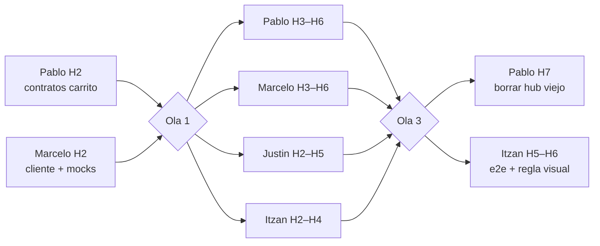

# Plan Farmacia ecommerce — 2026-09-25

> **Qué es:** el plan completo para que «Farmacia» del paciente deje de ser una pantalla con pestañas y pase
> a ser una tienda con estándar de ecommerce: buscador con filtros de precio y distancia (productos y
> farmacias), página de cada farmacia con su catálogo a precio real, carrito en la cabecera (uno por
> farmacia) y la receta completa como segunda vía de entrada — todo desembocando en el pedido y el checkout
> que ya existen. Se ejecuta en **8 carriles independientes (41–48)** sobre contratos congelados de antemano,
> para que ningún carril espere a otro. Los carriles están repartidos en
> [`repartos/2026-09-25/PromptNoche/`](../../repartos/2026-09-25/PromptNoche/Daily-Noche-2026-09-25.md)
> entre Pablo, Justin, Marcelo e Itzan.
>
> - Fuente: [`FARMACIA-ECOMMERCE-2026-09-25.md`](../../docs/requisitos/FARMACIA-ECOMMERCE-2026-09-25.md)
> - Hechos: [`VERIFICACION-CONTRA-CODIGO-2026-09-25.md`](../../docs/verificacion/VERIFICACION-CONTRA-CODIGO-2026-09-25.md)
> - Orden y dependencias: [`PLAN-MAESTRO.md`](../../docs/trabajo/2026-09-25-plan-y-reparto-farmacia-ecommerce/PLAN-MAESTRO.md)
> - Corte front: `origin/mockup` @ **`bf2c35452363ede1d367f94c4fd726b2b9a63cb1`** · API: `origin/dev` @ **`343795cc2d08745692f491c50e81427215043315`**
> - Peldaño de evidencia de este documento: **`DISCOVERED`**. Es un plan; no se ejecutó nada de él.

## 1 · Requerimiento confirmado

| # | Requisito | Cómo se lee en este plan |
|---|---|---|
| R1 | Estándar ecommerce | Farmacia = tienda: buscar → entrar a una farmacia → armar carrito → pedir → ver mis pedidos. Las tres pestañas actuales (Mis pedidos · Cotizaciones · Comprar) desaparecen como pestañas. |
| R2 | Carrito como ícono arriba | Ícono con contador en la cabecera, junto a la campana y Chats, visible en toda la sesión del paciente. |
| R3 | Carrito por farmacia específica | Un solo carrito activo, atado a UNA sede. Agregar algo de otra farmacia dispara el conflicto estándar: vaciar y cambiar de tienda. Persiste al recargar, por usuario. |
| R4 | Buscador con filtros precio y distancia | Puerta principal de Farmacia. **Ambos modos** (aclarado): resultados por producto y por farmacia/tienda. |
| R5 | Lugares cercanos desaparece | Sale del menú y del registro. **Cotizaciones se queda como está, aparte** (aclarado). |
| R6 | Receta completa, por ambas vías | Elegir una receta **ya emitida por el médico y visible en la historia clínica** (aclarado; sin subida de archivos) y buscar todos sus medicamentos con los mismos dos filtros. |
| R7 | Botón «lo más limpio» | Dentro de Farmacia, pegado al buscador («Buscar toda una receta»), no un renglón nuevo del menú. |
| R8 | Plan, no implementación | Este documento y los prompts del reparto. |

## 2 · Estado actual verificado (resumen; el detalle con archivo y línea está en la verificación)

**Ya existe y se reusa:** el pedido de punta a punta (`PharmacyOrdersClient.prepararBorrador()` → revisión `/my-account/pharmacy-orders/new` → checkout → `POST /pharmacy/orders`; con `requestId: ''` sirve sin receta) · «Dónde comprar mi receta» (`where-to-buy.ts`), que ya ordena una receta entera por `receta-completa` / `mas-cerca` / `mas-barato` y arma el borrador — **es la vía B construida** · las recetas del resumen clínico (`ClinicalClient.getSummary` → `medicationRequests[]`) · el selector de origen (`search-origin-picker/`) · el patrón de ícono con badge en la cabecera (Chats) · el store persistente por usuario (`TutorialProgressStore`) · en la API real, `GET /pharmacy/sites/:siteId/prices` y `GET /pharmacy/pharmacies/:id` con coordenadas · el `pharmacy-shop/` del PR #659 (lista de sedes, catálogo por farmacia, ± y carrito local), que se recicla.

**Falta:** carrito global e ícono (41) · `getPharmacy()`/`getSitePrices()` en el cliente y sus mocks (42) · la API real no lista sedes sueltas ni filtra productos por farmacia (47) · buscador con precio/distancia fuera de Cotizaciones (43) · página de tienda con precio real (44) · que la receta entre al carrito (45) · sacar «Lugares cercanos» y el hub viejo (46) · e2e del recorrido (48).

**Consecuencia aceptada:** «Lugares cercanos» tiene tres pestañas; la de farmacias sólo enlaza a where-to-buy, las otras dos (imagenología, centros médicos) usan `GET /public/nearby`. Al borrar la sección se pierde esa búsqueda desde el menú; «Cómo llegar» de la vitrina pública sigue funcionando.

## 3 · Arquitectura objetivo

```mermaid
flowchart TD
  NAV[Menú: Farmacia] --> HOME[Tienda<br/>/my-account/pharmacy]
  HOME -->|Productos: precio · distancia| RES[Resultados por producto]
  HOME -->|Farmacias: precio · distancia| STORES[Resultados por farmacia]
  HOME -->|Buscar toda una receta| RX[Elegir receta<br/>/pharmacy/prescriptions]
  RX --> WTB[where-to-buy/:requestId<br/>ya existe]
  RES -->|Agregar| CART[(CartStore<br/>una farmacia)]
  RES -->|Ver tienda| STORE[Farmacia<br/>/pharmacy/stores/:pharmacyId]
  STORES -->|Entrar| STORE
  STORE -->|+ / −| CART
  WTB -->|Agregar receta al carrito| CART
  HDR[Ícono carrito en cabecera] --> CARTPG[Carrito<br/>/pharmacy/cart]
  CART --> CARTPG
  CARTPG -->|Continuar| NEW[Revisión /pharmacy-orders/new<br/>ya existe]
  NEW --> CHK[Checkout → POST /pharmacy/orders<br/>ya existe]
  HOME -->|Mis pedidos| ORD[/pharmacy-orders<br/>ya existe]
```

| Ruta | Pantalla | Qué tiene | Estado |
|---|---|---|---|
| `/my-account/pharmacy` | **Tienda** | Buscador con modo Productos · Farmacias, orden Más barato · Más cerca, selector de origen, botón «Buscar toda una receta», enlace «Mis pedidos», «Tus últimos pedidos». Sin pestañas. | Reemplaza `PharmacyHub` (Justin) |
| `/my-account/pharmacy/stores/:pharmacyId` (`?site`) | **Farmacia** | Cabecera, promociones, catálogo con precio real (`sites/:siteId/prices`), buscador interno, ± por producto, «Requiere receta» sin control, selector de sede si hay más de una. | Recicla `pharmacy-shop/` (Itzan) |
| `/my-account/pharmacy/cart` | **Carrito** | Sede, líneas con ± y quitar, total estimado, Vaciar, Seguir comprando, Continuar → `prepararBorrador()` → revisión existente. Vacío = S3. | Nuevo (Pablo) |
| `/my-account/pharmacy/prescriptions` | **Elegir receta** | Recetas vigentes del resumen clínico → `where-to-buy/:requestId`. | Nuevo (Justin) |
| `/my-account/medical-record/where-to-buy/:requestId` | **Dónde comprar mi receta** | Se queda; gana «Agregar la receta al carrito» por sede. | Existente + 1 acción (Justin) |
| `/my-account/pharmacy-orders` (+ hijas) | **Mis pedidos** y el pedido | Sin cambios. | Existente |
| Cabecera | **Ícono carrito** | `app-nav-icon name="bag"` + badge con unidades, `aria-label` con número y farmacia, link a `/cart`. Sólo paciente. | Nuevo (Pablo) |

**Reglas del carrito (R3):** un carrito activo por usuario, atado a una sede · agregar de otra sede pide confirmación (vaciar y cambiar) · persiste en `localStorage` con clave por usuario, no-op en SSR · `requiresPrescription === true` no entra por la vía A; entra por la vía B con `requestId` · cada línea guarda el precio visto; al continuar se revalida con `availability()` · `enviar()` del pedido vacía el carrito.

## 4 · Contratos congelados (Ola 0)

Todo lo compartido se materializa en **dos commits de una hora** antes de que arranque cualquier otro carril: **MT-41-00** (Pablo H2: tipos, `CartStore` en memoria, rutas, testids) y **MT-42-00** (Marcelo H2: tipos, `getPharmacy`, `getSitePrices`, mocks). Después, cada carril compila, testea y mergea solo.

### 4.1 Carpeta y rutas — `features/account/pharmacy/pharmacy.routes.ts`

```typescript
export const PHARMACY_ROUTE = '/my-account/pharmacy';
export const PHARMACY_CART_ROUTE = `${PHARMACY_ROUTE}/cart`;
export const PHARMACY_PRESCRIPTIONS_ROUTE = `${PHARMACY_ROUTE}/prescriptions`;
export const pharmacyStoreRoute = (pharmacyId: string, siteId?: string) =>
  siteId ? `${PHARMACY_ROUTE}/stores/${pharmacyId}?site=${siteId}` : `${PHARMACY_ROUTE}/stores/${pharmacyId}`;
// Existentes, no se tocan: MIS_PEDIDOS_ROUTE = '/my-account/pharmacy-orders'; where-to-buy/:requestId
```

La sección `my-account/pharmacy` del registro se queda («Farmacia», `roles: ['PATIENT']`); `stores/:pharmacyId`, `cart` y `prescriptions` son pantallas hijas (`PANTALLAS_HIJAS`). Redirecciones: `?tab=cotizaciones` → `/my-account/cotizaciones`; `?tab=comprar` → `/my-account/pharmacy`; `/nearby-places` → `/my-account/pharmacy`.

### 4.2 Tipos del carrito — `core/data-access/pharmacy-cart/pharmacy-cart.types.ts`

```typescript
export interface CartSite { readonly pharmacyId: string; readonly pharmacyName: string; readonly siteId: string; readonly siteName: string; readonly addressText: string | null; }
export interface CartLine { readonly productId: string; readonly name: string; readonly presentation: string | null; readonly quantity: number; readonly unitAmount: string | null; readonly currency: string | null; readonly requiresPrescription: boolean; readonly medicationConceptId: string | null; }
export interface CartState { readonly site: CartSite; readonly requestId: string | null; readonly lines: readonly CartLine[]; readonly updatedAt: string; }
export type AddOutcome = 'added' | 'conflict' | 'requires-prescription';
```

### 4.3 API del `CartStore` — `core/data-access/pharmacy-cart/cart.store.ts`

| Miembro | Contrato |
|---|---|
| `cart: Signal<CartState \| null>` | El carrito activo o `null`. |
| `unitCount: Signal<number>` | Suma de `quantity`. Es lo que muestra el badge. |
| `estimatedTotal: Signal<{ amount: string; currency: string } \| null>` | `null` si alguna línea no tiene precio o mezclan moneda. Suma en centavos (`pharmacy-campaigns.money.ts`). |
| `add(site, line, quantity = 1): AddOutcome` | `conflict` con otra sede (no cambia nada); `requires-prescription` si la línea lo exige y `requestId` es `null`; si no, suma o crea. |
| `replaceWith(site, lines, requestId): void` | Vacía y arma de nuevo. |
| `setQuantity(productId, quantity): void` | `0` quita; vacío → `null`. |
| `remove(productId): void` · `clear(): void` | |
| `toDraft(site: AvailabilitySite): BorradorDePedido` | Misma forma que `borradorDePedido()` de where-to-buy; `requestId` del carrito o `''`. |

Persistencia: `InjectionToken<CartStorage>` sobre `localStorage`, clave `mantra.pharmacy.cart.<userId>`, `effect()` sobre `auth.userId()`, no-op en servidor.

### 4.4 Cliente y mocks — `core/data-access/pharmacy/`

| Método | Endpoint | Estado |
|---|---|---|
| `listPharmacies()` | `GET /pharmacy/pharmacies` | existe |
| `getPharmacy(id)` → `PharmacyDetail` (`sites[]`: `id, name, addressText, latitude, longitude`) | `GET /pharmacy/pharmacies/:id` | **Ola 0** (Marcelo) |
| `searchProducts({ search?, conceptId?, pharmacyId?, limit? })` | `GET /pharmacy/products` | existe (`pharmacyId` sólo en mock; API real: carril 47) |
| `getSitePrices(siteId, productId?)` → `PharmacySitePrices` (`items[]`: `productId, productCode, brandName, genericName, strengthText, packageSizeText, medication, requiresPrescription, unitAmount, patientAmount, currency`) | `GET /pharmacy/sites/:siteId/prices` | **Ola 0** (Marcelo) |
| `nearbySites({ search?, origin?, limit? })` | `GET /pharmacy/sites` | existe (sólo mock; API real: carril 47) |
| `availability({ productIds, origin?, limit? })` | `GET /pharmacy-inventory/availability` | existe |

### 4.5 Ids de prueba congelados

`pharmacy-search-mode` · `pharmacy-search-term` · `pharmacy-search-sort` · `pharmacy-search-origin` · `pharmacy-search-results` · `pharmacy-result-add` · `pharmacy-result-store` · `pharmacy-prescription-button` · `pharmacy-store-header` · `pharmacy-store-catalog` · `pharmacy-store-qty-plus` · `pharmacy-store-qty-minus` · `pharmacy-store-qty-value` · `pharmacy-store-rx-badge` · `header-cart` · `header-cart-badge` · `pharmacy-cart-lines` · `pharmacy-cart-total` · `pharmacy-cart-continue` · `pharmacy-cart-clear` · `pharmacy-cart-conflict-dialog` · `pharmacy-prescriptions-list` · `pharmacy-prescription-search` · `where-to-buy-add-to-cart`.

### 4.6 Reglas transversales

Identificadores, rutas y archivos nuevos en inglés; textos en castellano · cada estado asíncrono con `ViewState<T>` y `app-view-state-host` · reusar `SearchField`, `SegmentedControl`/`Select`, `SearchOriginPicker`, `Card`, `Badge`, `AppButton`, `DialogService`, `PageHeader`, `ViewStateHost`; nada nuevo en `shared/` sin segunda necesidad · tarjeta a lo ancho, mobile-first, claro y oscuro · sin `skip`, sin aserciones borradas; los dos rojos preexistentes (`shell-layout` íconos, lint de `navigation.service.spec:16`) se anotan, no se tocan.

## 5 · Carriles y reparto

| Carril | Nombre | Persona | Archivos propios (nadie más los toca) | Depende de | Estimación |
|---|---|---|---|---|---|
| **41** | Carrito y cabecera | **Pablo** | `core/data-access/pharmacy-cart/` · `pharmacy.routes.ts` · `pharmacy.testids.ts` · `features/account/pharmacy/cart/` · `shell-layout.*` (bloque del ícono) · `pharmacy-orders.client.ts` (sólo `clear()`) | Ola 0 propia | 12 h |
| **42** | Datos: cliente y mocks | **Marcelo** | `core/data-access/pharmacy/*` · `core/mock/handlers/pharmacy.handlers.ts` (+ spec nuevo) | Nada | 6 h |
| **43** | Buscador de la tienda (home) | **Justin** | `features/account/pharmacy/store-front/` · `search/` · entrada `my-account/pharmacy` de `app.routes.ts` | Ola 0 | 16 h |
| **44** | Página de farmacia | **Itzan** | `features/account/pharmacy/store/` · su entrada de ruta hija | Ola 0 | 14 h |
| **45** | Receta completa al carrito | **Justin** | `features/account/pharmacy/prescriptions/` · `medical-record/where-to-buy/*` · su entrada de ruta hija | Ola 0 | 10 h |
| **46** | Navegación y limpieza | **Pablo** | `core/navigation/**` · `access-tree.ts` · tutoriales · specs de navegación · `nearby-places.*` (borrar; no el picker) · `pharmacy-hub/` (borrar al final) · `RUTAS_HEREDADAS` | Nada; su última MT en Ola 3 | 8 h |
| **47** | Backend: contrato real | **Marcelo** | `mantra-core-health-api/src/modules/pharmacy/*` · `openapi/` | Nada (repo aparte, `dev`) | 10 h |
| **48** | QA, e2e y evidencia | **Itzan** | `playwright/pharmacy-*.spec.ts` · `docs/progress/evidence/lane-48/` | 41–46 mergeados (Ola 3) | 12 h |

Ender queda fuera de este reparto por pedido del propietario. `app.routes.ts` es el único archivo compartido: una entrada por carril, un conflicto de una línea lo resuelve quien mergea segundo. `search-origin-picker/` no lo toca nadie. `component-index.generated.ts` se regenera, no se edita.

## 6 · Microtareas por carril

Viven en el prompt de cada persona, que es donde se ejecutan y se marcan (una sola verdad del estado):

| Persona | Prompt | Hitos · subtareas · microtareas |
|---|---|---|
| Pablo | [`CarritoEnLaCabeceraYAdiosLugaresCercanos.md`](../../repartos/2026-09-25/PromptNoche/Pablo/Noche-Farmacia.CarritoYNavegacion/CarritoEnLaCabeceraYAdiosLugaresCercanos.md) | 8 · 12 · 43 |
| Justin | [`BuscadorPorPrecioYDistanciaYLaRecetaAlCarrito.md`](../../repartos/2026-09-25/PromptNoche/Justin/Noche-Farmacia.TiendaYReceta/BuscadorPorPrecioYDistanciaYLaRecetaAlCarrito.md) | 6 · 11 · 41 |
| Marcelo | [`ClienteMocksYEndpointsRealesDeFarmacia.md`](../../repartos/2026-09-25/PromptNoche/Marcelo/Noche-Farmacia.DatosYContratoReal/ClienteMocksYEndpointsRealesDeFarmacia.md) | 7 · 8 · 30 |
| Itzan | [`CatalogoConPrecioRealYRecorridosDePuntaAPunta.md`](../../repartos/2026-09-25/PromptNoche/Itzan/Noche-Farmacia.PaginaDeFarmaciaYQA/CatalogoConPrecioRealYRecorridosDePuntaAPunta.md) | 6 · 12 · 45 |
| | **Total** | **27 · 43 · 159** |

## 7 · Orden de ejecución y paralelismo



| Ola | Qué corre | En paralelo | Espera a | Duración |
|---|---|---|---|---|
| 0 | Pablo H2 y Marcelo H2 | 2 | Nada | ~1 h |
| 1 | Pablo H3–H6, Marcelo H3–H6 (incluye la API), Justin H2–H5, Itzan H2–H4 | 4 | Ola 0 mergeada en `mockup` | ~16 h de reloj (el más largo es Justin) |
| 3 | Pablo H7, Itzan H5–H6 | 2 | Ola 1 mergeada | ~12 h |

Por qué no hay bloqueantes en la Ola 1: los tipos, el store y el cliente existen antes de empezar; cada carril prueba con `HttpTestingController`; los archivos son disjuntos; nadie depende del backend real (la maqueta usa mocks); el hub viejo no se borra hasta el final. Lo que no llega a tiempo se simula en tres niveles y se declara (regla 65), nunca se espera.

## 8 · Definition of Done, QA y evidencia

Un carril está DONE sólo en `REGRESSION_VERIFIED`: compila (`typecheck`), estilo (`eslint` sobre lo tocado), unitario dirigido en verde sin `skip`, revisión de código, `build` con el presupuesto inicial ≤ 1,3 MB, fotos 375 · 768 · 1440 claro + 1440 oscuro con la regla visual medida, accesibilidad (nombres, foco, teclado, contraste AA), estados M34 completos, e2e de Itzan en verde con `--workers=1`, y evidencia en `docs/progress/evidence/lane-NN/`. Los cinco recorridos que Itzan tiene que **ver** pasar: tienda → carrito; carrito → conflicto → pedido → badge vacío; receta → carrito → pedido con receta; recargar y cambiar de usuario; `/nearby-places` redirige y Cotizaciones sigue en su renglón.

## 9 · Qué no entra, riesgos y decisiones

**No entra:** tocar Cotizaciones · tocar la revisión, el checkout, el detalle, el recibo o la factura · backend para el carrito · recetas externas (foto/PDF) · precio en el buscador sin `availability()` · pagos, cupones, favoritos · mover `search-origin-picker/` · modelo, DDL, seeds.

| Riesgo | Mitigación |
|---|---|
| Dos carriles editan el mismo archivo | Archivos propios (§5); `app.routes.ts` una línea por carril; el hub se borra al final |
| El precio del catálogo no coincide con el del pedido | Un solo origen en el mock (Marcelo H3.S2); revalidación al continuar, dicha en pantalla |
| Carrito con receta obligatoria sin receta | `add()` devuelve `requires-prescription`; sólo `replaceWith` con `requestId` mete esos productos |
| Presupuesto del bundle (1,29 de 1,3 MB) | Todo diferido por ruta; el ícono no importa la tienda |
| Specs con listas cerradas | Se corrige la lista, nunca se salta el test |
| Imagenología y centros cercanos pierden pantalla | Decisión registrada (Pablo H6.S3); «Cómo llegar» sigue |
| API real sin `/pharmacy/sites` ni `pharmacyId` | Marcelo H4–H5 en paralelo; hasta entonces `mockBackend` cubre |

**Decisiones:** el botón de receta va dentro de Farmacia, junto al buscador · la página de farmacia es por `pharmacyId` con `?site` · el carrito guarda el precio visto y se revalida al continuar · modo Farmacias sin término ordena por distancia o nombre; el orden por precio sólo aplica con un término · Mis pedidos no cambia de ruta · `bag` como ícono del carrito.

**Preguntas abiertas (con el valor por defecto):** el carrito se ve en toda la sesión del paciente (sí) · tope por línea (stock de la sede, 99 en pantalla) · farmacias sin productos (no se listan) · el carrito sobrevive al cierre de sesión para el mismo usuario (sí).
